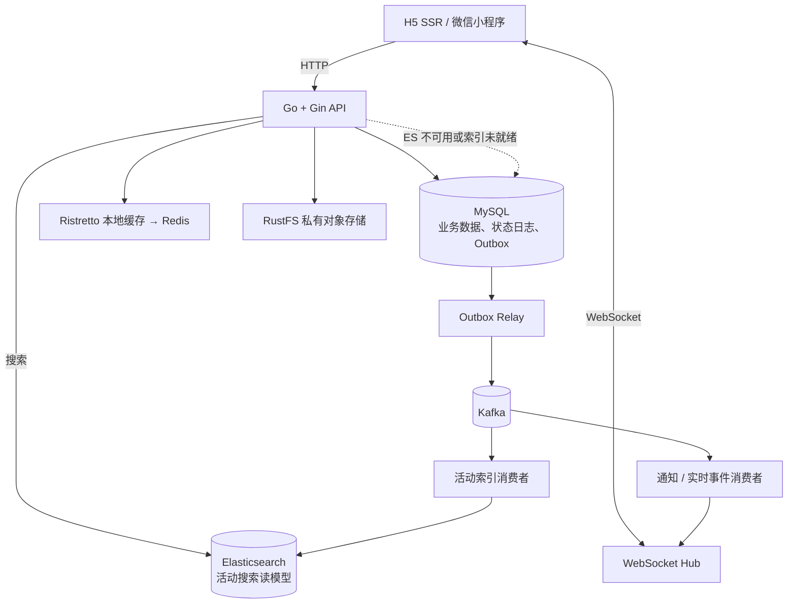

# CampusHub

CampusHub 是校园活动与票据核销平台，覆盖活动发布与审核、报名审批、电子票据、现场核销、群聊、通知和学生认证。前端基于 uni-app 同时发布 H5 SSR 与微信小程序；后端提供版本化 HTTP API 和 WebSocket 实时事件。

## 技术架构

- **客户端**：Vue 3、TypeScript、Pinia、uni-app，支持 H5 SSR 和微信小程序。
- **应用层**：Go 1.24、Gin、GORM；按 `handler → service → repository → model` 分层，HTTP 响应统一为 `{ code, message, data, trace_id }`。
- **数据与缓存**：MySQL 是业务事实来源；Ristretto 本地缓存与 Redis 构成多级缓存，承担热点读取、Token、验证码和在线状态。
- **异步与实时**：业务事务同时写入 Outbox，Relay 可靠投递 Kafka；消费者驱动通知、活动索引和跨实例 WebSocket 广播。WebSocket 仅负责实时提示，断线后由 HTTP 接口补偿。
- **搜索与文件**：Elasticsearch 保存活动搜索读模型，异常或索引未就绪时自动回退 MySQL；RustFS 存储活动图片和认证文件。



## 本地启动

### 前置条件

- Go 1.24+
- Node.js 18+、npm
- Docker 与 Docker Compose
- 本机端口可用：`8080`、`13306`、`16379`、`19092`、`19200`、`19000`、`19001`、`18025`

### 1. 拉取代码与子模块

```sh
git clone --recurse-submodules <repository-url>
cd campus-hub
```

若仓库已克隆但尚未初始化前端子模块：

```sh
git submodule update --init --recursive
```

### 2. 启动后端及依赖

Compose 仅启动本地依赖，Go 服务运行在宿主机。`.env` 仅用于本地开发，禁止提交真实密钥；中间件健康检查通过后再执行迁移和索引重建。

```sh
cd backend
cp .env.example .env
make dev-up
make migrate-up
make reindex
make run
```

服务启动后可访问：

- API：`http://127.0.0.1:8080/api/v1`
- 存活检查：`http://127.0.0.1:8080/health`
- 就绪检查：`http://127.0.0.1:8080/ready`
- Mailpit：`http://127.0.0.1:18025`
- RustFS Console：`http://127.0.0.1:19001`

常用命令：

```sh
make test                 # Go 单元测试
make lint                 # gofmt + go vet
make integration          # Docker 集成测试
make reindex              # MySQL 全量重建活动搜索索引
make dev-down             # 停止本地依赖
```

### 3. 启动前端

另开终端，在项目根目录执行：

```sh
cd frontend
npm ci
```

创建本地环境文件，将接口地址指向本地后端：

```sh
cat > .env.local <<'EOF'
VITE_BASE_URL=http://127.0.0.1:8080
VITE_WS_URL=ws://127.0.0.1:8080/ws
EOF
```

启动 H5 SSR 或编译微信小程序：

```sh
npm run dev:h5:ssr
npm run dev:mp-weixin
```

微信小程序构建产物位于 `frontend/dist/dev/mp-weixin`，使用微信开发者工具导入该目录即可调试。

生产构建与类型检查：

```sh
npm run type-check
npm run build:h5:ssr
npm run build:mp-weixin
```

## 项目目录

```text
.
├── backend/                         # Go 后端模块
│   ├── cmd/                         # server、migrate、reindex 入口
│   ├── configs/                     # 开发与测试配置
│   ├── internal/
│   │   ├── handler/                 # HTTP / WebSocket 请求处理
│   │   ├── service/                 # 业务编排、状态机、Outbox 消费
│   │   ├── repository/              # 数据访问
│   │   ├── platform/                # MySQL、Redis、Kafka、ES、RustFS 适配器
│   │   ├── realtime/                # WebSocket Hub 与在线状态
│   │   └── router/                  # 路由与依赖装配
│   ├── migrations/mysql/            # golang-migrate 数据库迁移
│   ├── scripts/                     # 集成测试、WebSocket 探针、压测工具
│   └── deploy/docker/               # 本地依赖与服务镜像 Compose 配置
├── frontend/                        # Git 子模块：uni-app 前端
│   └── src/                         # 页面、组件、状态、v1 API 与 WebSocket 客户端
├── docs/
│   ├── system_design/               # 架构、协议、数据模型与部署契约
│   ├── test/                        # 核心链路压测方案与脱敏结果
│   └── resume/                      # 项目简历描述
└── .github/workflows/               # CI 工作流
```

## 文档与约定

- [系统设计文档](docs/system_design/README.md)：架构、HTTP、WebSocket、Kafka、ES、配置和部署的契约来源。
- [OpenAPI](backend/api/openapi.yaml)：HTTP 接口定义。
- [压测方案与结果](docs/test/)：核心链路、执行方法和开发机基线。
- [开发协作规范](AGENTS.md)：分层、迁移、配置、安全和提交要求。

提交前建议执行：

```sh
cd backend
test -z "$(gofmt -l .)" && go vet ./... && go test -race ./...
```
