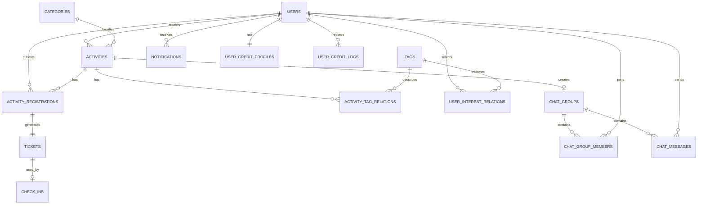
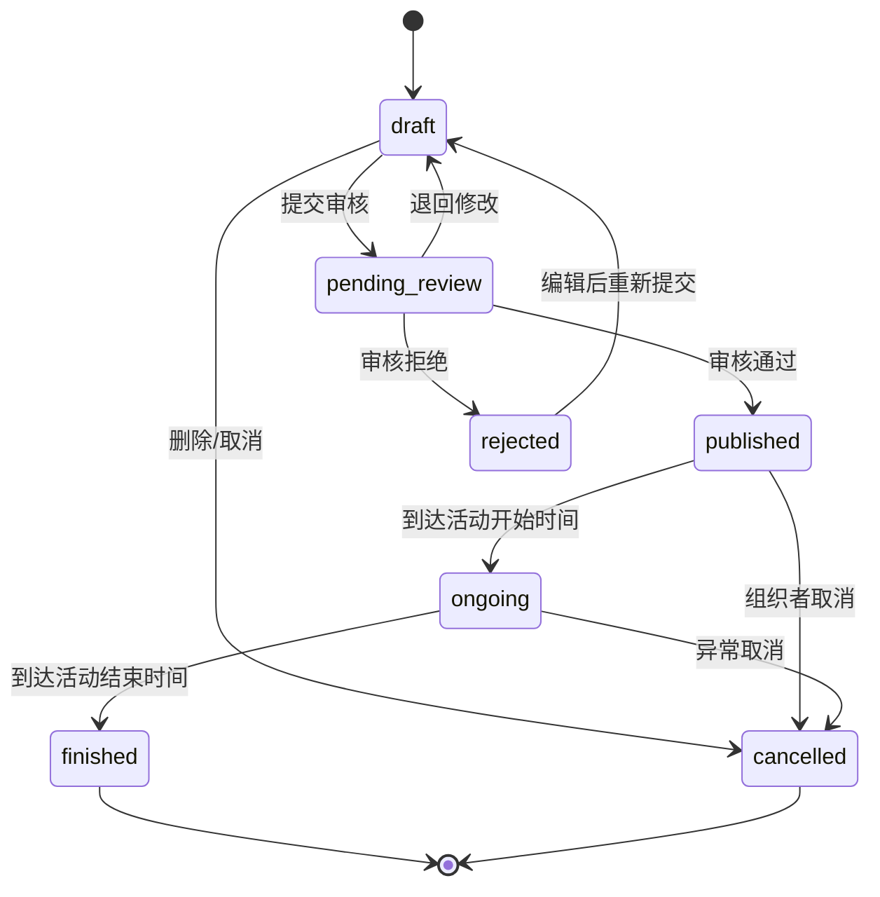
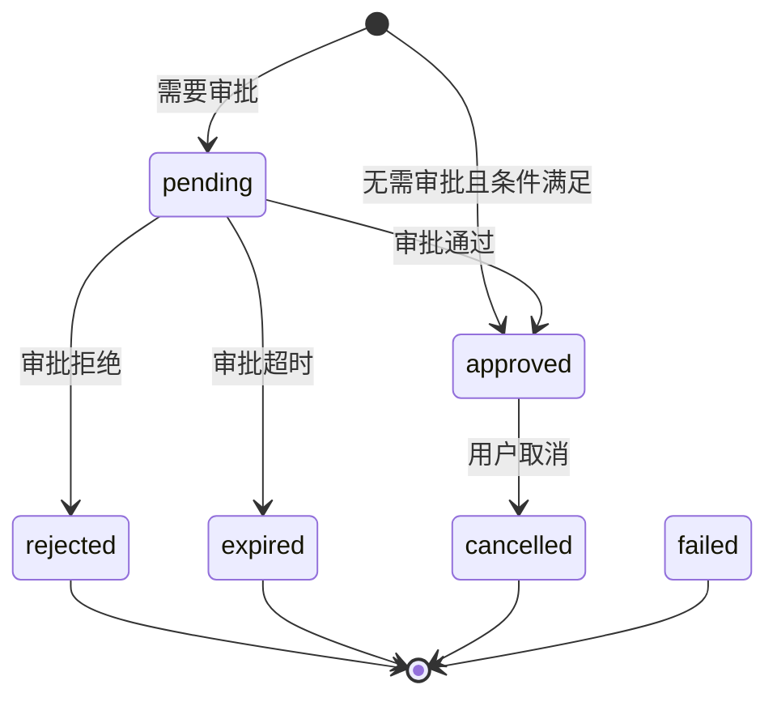
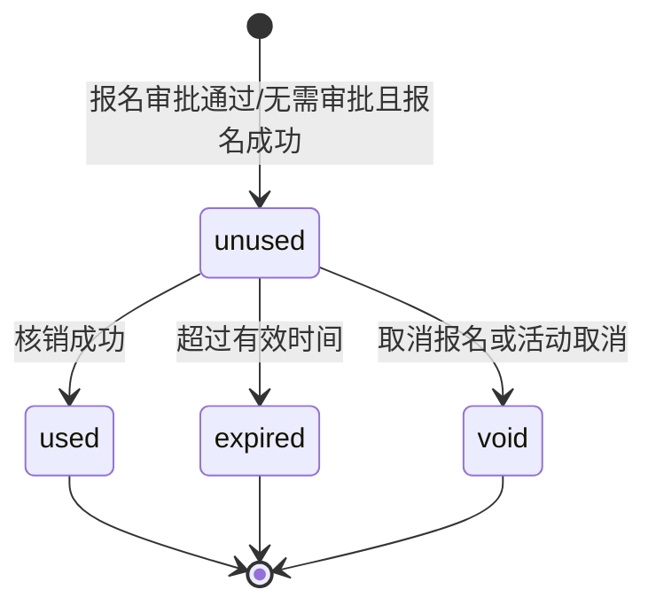
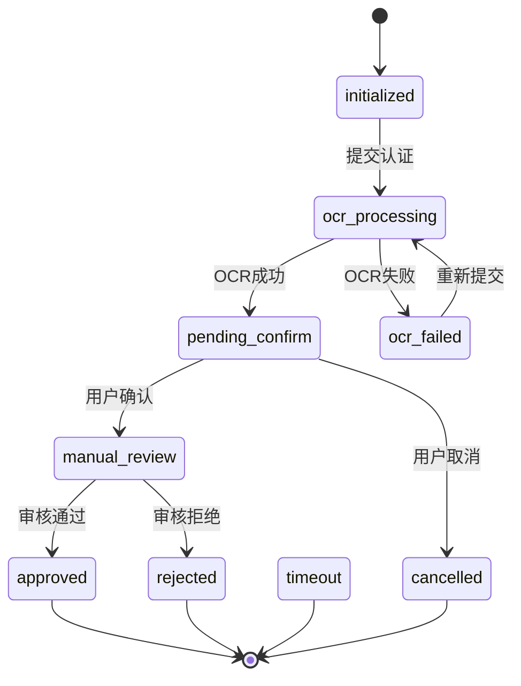

# 业务领域设计

## 1. 文档目的

本文定义 CampusHub 的业务域、角色、核心实体、状态流转、权限边界和关键业务规则，为接口设计、数据库设计和代码模块划分提供统一语言。

## 2. 业务定位

CampusHub 是面向校园场景的活动发布、报名、票据核销和活动沟通平台。

核心目标：

1. 帮助组织者发布和管理校园活动；
2. 帮助学生发现、报名和参加活动；
3. 通过票据和核销机制确认实际参与；
4. 通过活动群和通知完成活动沟通；
5. 通过学生认证和信用分降低活动管理风险。

## 3. 业务域划分

### 3.1 身份与账号域

负责：

- 注册；
- 登录；
- 退出；
- Token 刷新；
- 账号注销；
- 用户资料；
- 角色；
- 用户状态；
- 密码管理。

核心实体：

- 用户；
- 角色；
- 用户角色关系；
- 登录凭证；
- 刷新令牌。

### 3.2 用户资料与信用域

负责：

- 头像；
- 昵称；
- 简介；
- 性别；
- 年龄；
- 兴趣标签；
- 学生认证；
- 信用分；
- 信用变更记录。

核心实体：

- 用户资料；
- 学生认证；
- 信用账户；
- 信用流水；
- 兴趣标签；
- 用户兴趣关系。

### 3.3 活动域

负责：

- 活动草稿；
- 活动审核；
- 活动发布；
- 活动编辑；
- 活动取消；
- 活动状态流转；
- 活动分类；
- 活动标签；
- 活动列表；
- 活动详情；
- 活动统计。

核心实体：

- 活动；
- 分类；
- 标签；
- 活动标签关系；
- 活动状态日志；
- 标签统计。

### 3.4 报名与票据域

负责：

- 活动报名；
- 报名取消；
- 报名审批；
- 报名条件校验；
- 票据生成；
- 票据查询；
- 票据核销；
- 核销记录。

核心实体：

- 报名记录；
- 票据；
- 核销记录。

### 3.5 聊天与通知域

负责：

- 活动群；
- 群成员；
- 群消息；
- 图片消息；
- 消息已读；
- 在线状态；
- 离线消息；
- 系统通知；
- 通知已读。

核心实体：

- 活动群；
- 群成员；
- 消息；
- 通知。

### 3.6 文件与搜索域

负责：

- 图片上传；
- 文件元数据；
- 文件引用计数；
- 活动搜索；
- 搜索索引同步；
- 全量索引重建。

核心实体：

- 文件；
- 活动搜索索引；
- Outbox 事件。

## 4. 角色定义

| 角色 | 说明 | 典型权限 |
|---|---|---|
| 游客 | 未登录用户 | 浏览公开活动、查看活动详情、查看公开用户主页 |
| 普通用户 | 已登录用户 | 报名活动、维护个人资料、查看票据、加入活动群、接收通知 |
| 已认证学生 | 学生认证通过的用户 | 报名要求学生认证的活动 |
| 活动组织者 | 创建活动的用户 | 创建、编辑、取消活动，查看报名人员，核销票据，管理活动群 |
| 管理员 | 平台管理人员 | 审核活动、处理举报、管理用户、查看审计记录 |
| 系统 | 定时任务或异步消费者 | 自动更新活动状态、发送通知、同步搜索索引、生成统计数据 |

活动组织者不是独立用户类型，而是用户在某个活动上下文中的角色。

## 5. 核心实体关系

## 6. 活动状态机

### 6.1 状态定义

| 状态 | 含义 | 是否公开可见 |
|---|---|---|
| `draft` | 草稿 | 否 |
| `pending_review` | 待审核 | 否 |
| `published` | 已发布/报名中 | 是 |
| `ongoing` | 进行中 | 是 |
| `finished` | 已结束 | 是 |
| `rejected` | 审核拒绝 | 否 |
| `cancelled` | 已取消 | 否或特殊可见 |

### 6.2 状态流转

### 6.3 活动状态规则

- 草稿仅创建者可见；
- 待审核活动不能被普通用户报名；
- 已发布活动根据报名时间窗口判断是否可报名；
- 活动开始后进入进行中；
- 活动结束后不能继续报名或核销；
- 活动取消后，相关报名、票据和群需要按规则处理；
- 所有状态变更需要记录活动状态日志。

## 7. 报名状态机

### 7.1 状态定义

| 状态 | 含义 |
|---|---|
| `pending` | 待审批，用于需要审批的活动 |
| `approved` | 报名成功 |
| `rejected` | 报名被拒绝 |
| `cancelled` | 用户主动取消 |
| `failed` | 报名失败，例如名额不足或条件不满足 |
| `expired` | 待审批超时，释放预留名额 |

新系统正式支持活动报名审批，因此在旧系统成功、取消、失败三类状态基础上，增加待审批、已拒绝和待审批超时状态。

### 7.2 状态流转

### 7.3 报名规则

- 同一用户对同一活动只能存在一条有效报名；
- 非公开活动不能报名；
- 不在报名时间窗口内不能报名；
- 活动要求学生认证时，未认证用户不能报名；
- 用户信用分低于活动要求时不能报名；
- 活动名额满时不能报名；
- 需要审批的活动，报名后进入 `pending`，通过后才生成票据；
- 无需审批的活动，报名成功后直接生成票据；
- 待审批记录需要设置过期时间，超时后释放预留名额；
- 用户取消报名或报名被拒绝后，应退出活动群；已生成票据应作废；
- 报名记录、名额占用和计数更新必须在同一数据库事务内完成。
- 报名状态 `expired` 是终态；超时任务必须写入状态日志、释放预留名额并发布状态变化事件。

## 8. 票据状态机

| 状态 | 含义 |
|---|---|
| `unused` | 未使用 |
| `used` | 已核销 |
| `expired` | 已过期 |
| `void` | 已作废 |

票据规则：

- 一次有效报名对应一张票据；
- 票据短码和 UUID 均唯一；
- 票据只能在有效时间内核销；
- 一张票据只能核销一次；
- 核销必须支持幂等；
- 核销成功后创建核销记录。

## 9. 学生认证状态机

| 状态 | 含义 |
|---|---|
| `initialized` | 已初始化 |
| `ocr_processing` | OCR 识别中 |
| `pending_confirm` | 等待用户确认 OCR 结果 |
| `manual_review` | 人工审核中 |
| `approved` | 认证通过 |
| `rejected` | 认证拒绝 |
| `timeout` | 认证超时 |
| `cancelled` | 用户取消 |
| `ocr_failed` | OCR 失败 |

认证规则：

- 一个用户同一时间只能存在一条未完成认证记录；
- 真实姓名和学号属于敏感信息；
- 学号应加密存储，并通过哈希值支持唯一约束；
- 认证进度通过 WebSocket 推送；
- 认证通过后用户获得已认证学生身份。

## 10. 聊天域规则

- 一个活动最多对应一个活动群；
- 活动发布或审核通过后创建活动群；
- 活动组织者默认是群主；
- 无需审批的活动，报名成功后加入活动群；
- 需要审批的活动，审批通过后加入活动群；
- 取消报名、报名被拒绝或审批超时后，用户退出活动群；
- 活动取消后群可解散或转为只读；
- 消息必须落库，WebSocket 只负责实时投递；
- 接收方离线时保留离线消息和未读计数；
- 群成员只能查看自己所属群的消息。

## 11. 通知规则

通知类型包括：

- 系统通知；
- 活动审核结果；
- 活动取消通知；
- 报名结果；
- 群邀请；
- 学生认证进度；
- 票据和核销相关通知。

通知规则：

- 通知必须指定接收用户；
- 通知支持附加 JSON 数据；
- 通知支持单条已读和全部已读；
- 未读数量可通过 Redis 维护并以数据库为准；
- 通知创建后可通过 Kafka 异步投递到 WebSocket。

## 12. 权限矩阵

| 操作 | 游客 | 普通用户 | 已认证学生 | 活动组织者 | 管理员 |
|---|---|---|---|---|---|
| 浏览公开活动 | 是 | 是 | 是 | 是 | 是 |
| 查看活动详情 | 是 | 是 | 是 | 是 | 是 |
| 报名普通活动 | 否 | 是 | 是 | 是 | 是 |
| 报名要求认证活动 | 否 | 否 | 是 | 是 | 是 |
| 创建活动 | 否 | 是 | 是 | 是 | 是 |
| 编辑自己的活动 | 否 | 否 | 否 | 是 | 是 |
| 取消自己的活动 | 否 | 否 | 否 | 是 | 是 |
| 查看活动报名人员 | 否 | 否 | 否 | 是 | 是 |
| 核销票据 | 否 | 否 | 否 | 是 | 是 |
| 审核活动 | 否 | 否 | 否 | 否 | 是 |
| 查看用户公开主页 | 是 | 是 | 是 | 是 | 是 |
| 维护个人资料 | 否 | 是 | 是 | 是 | 是 |
| 查看自己的票据 | 否 | 是 | 是 | 是 | 是 |
| 查看活动群消息 | 否 | 是 | 是 | 是 | 是 |
| 管理全部用户 | 否 | 否 | 否 | 否 | 是 |

## 13. 关键约束

1. 所有业务写入以 MySQL 事务结果为准。
2. 所有状态变更必须可追踪。
3. 所有需要权限的资源都必须在服务层校验，不能只依赖前端隐藏入口。
4. 所有异步事件必须具备唯一事件 ID，消费者必须幂等。
5. 所有缓存都必须有过期时间或版本机制。
6. 搜索结果延迟应可接受，不能把 Elasticsearch 作为事务写入依赖。
7. 涉及学生认证和个人信息的数据必须最小化暴露。
8. 对外资源标识统一使用 UUID，内部自增 ID 仅用于数据库关联和索引。
