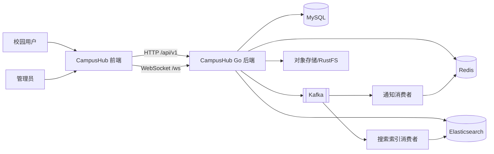
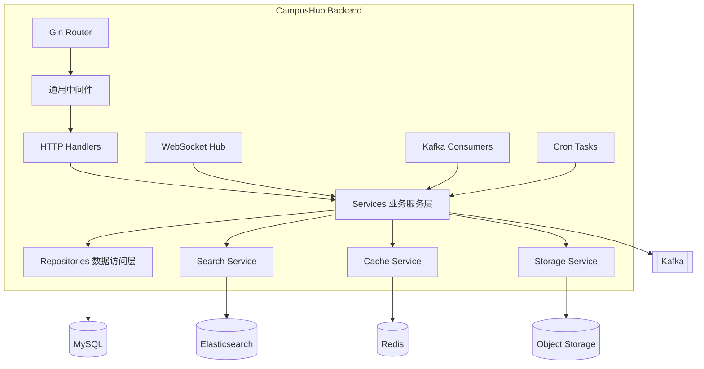
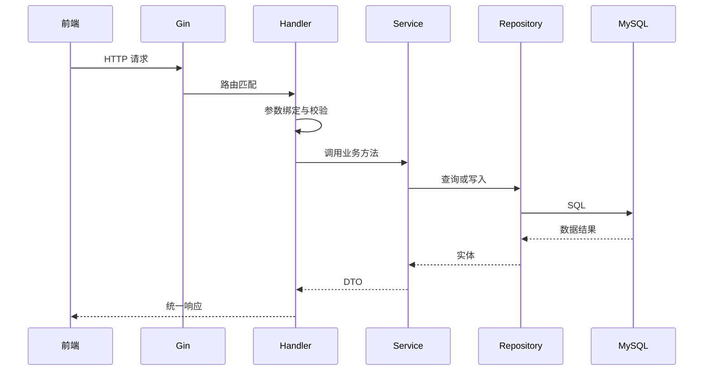
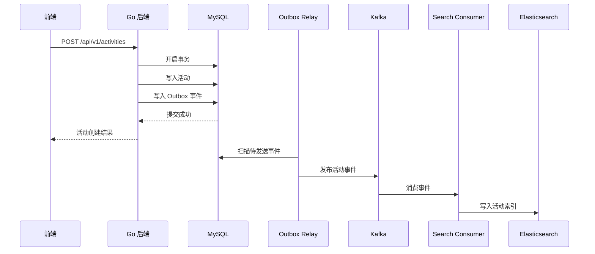
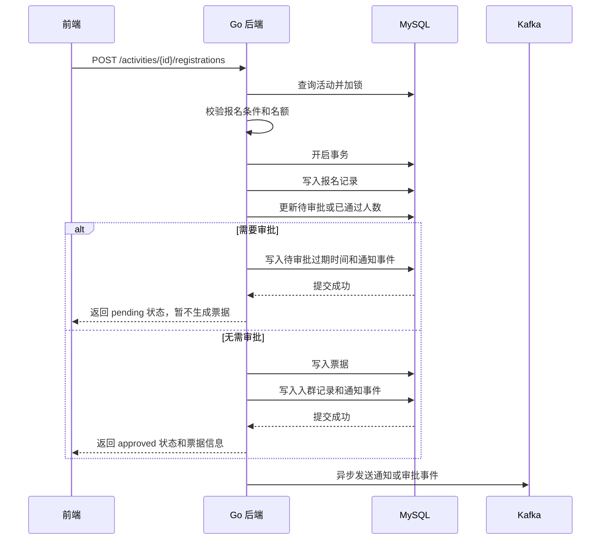
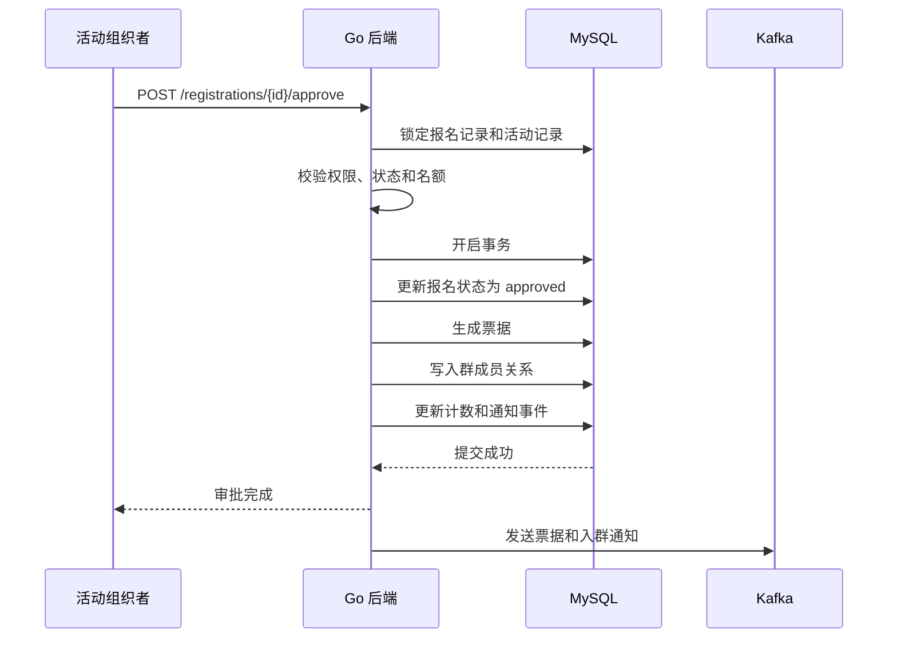
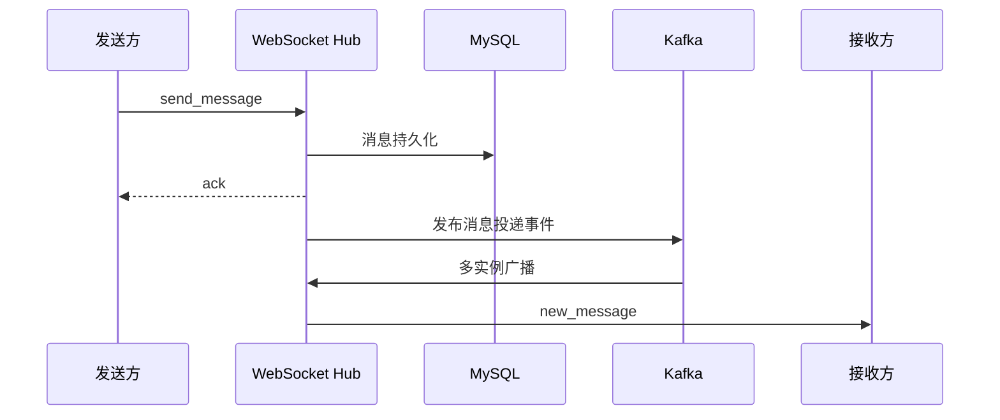

# 架构总览

## 1. 文档目的

本文说明新 CampusHub 后端的整体架构、运行组件、模块边界、关键请求链路和部署拓扑，作为后续开发和中间件接入的总览依据。

## 2. 架构目标

新后端采用 Go 技术栈下的模块化单体，目标是：

- 降低本地开发和部署复杂度；
- 保持清晰的业务模块边界；
- 支持水平扩展和实时通信；
- 使用 Kafka 处理异步任务；
- 使用 Elasticsearch 提供活动搜索；
- 使用 Redis 提供缓存、在线状态和分布式锁；
- 为后续服务拆分保留边界。

## 3. 技术组件

核心组件：

- Gin：HTTP 服务；
- GORM：数据访问；
- MySQL：业务主存储；
- Redis：缓存、Token、验证码、锁和在线状态；
- Kafka：异步事件；
- Elasticsearch：活动搜索；
- WebSocket：实时消息；
- Ristretto：本地缓存；
- Viper：配置管理；
- Docker：本地和部署环境。

可选组件：

- Kibana：Elasticsearch 调试；
- Kafka UI：Kafka 调试；
- RustFS：本地对象存储；
- Prometheus：指标采集；
- Grafana：指标展示和告警。

## 4. 系统上下文

## 5. 应用架构

后端采用模块化单体，一个可执行程序内包含 HTTP 服务、WebSocket 服务、Kafka 消费者和定时任务。不同运行能力可以通过配置开关控制。

## 6. 分层职责

### 6.1 Handler 层

职责：

- 接收 HTTP 请求；
- 参数绑定和基础校验；
- 调用 Service；
- 构造响应；
- 不直接访问数据库。

### 6.2 Service 层

职责：

- 承载业务规则；
- 控制事务；
- 调用 Repository；
- 发布领域事件；
- 处理缓存和搜索相关编排；
- 执行权限判断。

### 6.3 Repository 层

职责：

- 封装 GORM 查询；
- 管理数据库访问；
- 不处理业务流程；
- 不直接依赖 HTTP 或 WebSocket。

### 6.4 WebSocket Hub

职责：

- 管理连接；
- 管理认证；
- 管理房间和订阅；
- 实时投递消息；
- 不把连接状态作为唯一业务事实。

### 6.5 Consumer

职责：

- 消费 Kafka 事件；
- 执行搜索索引、通知、统计等异步任务；
- 实现幂等、重试和失败记录。

### 6.6 Task

职责：

- 活动状态自动流转；
- 超时认证处理；
- 票据过期处理；
- 统计任务；
- Outbox 事件投递。

## 7. 关键链路

### 7.1 普通 HTTP 请求

### 7.2 活动创建与搜索同步

### 7.3 活动报名

### 7.4 报名审批通过

### 7.5 WebSocket 实时消息

## 8. 多实例部署

后端可部署多个实例。需要解决：

- WebSocket 连接分散在不同实例；
- 定时任务不能重复执行；
- 本地缓存失效需要广播；
- Kafka 消费者组负责消费分配；
- 无状态 HTTP 请求可由负载均衡轮询。

多实例协作方式：

- WebSocket 连接路由和在线状态存 Redis；
- 实例间消息广播通过 Kafka；每个 WebSocket 实例使用独立的 Chat Delivery 消费组，Redis 只保存在线状态和连接定位；
- 定时任务通过 Redis 分布式锁保证单实例执行；
- 本地缓存通过失效事件主动删除。

## 9. 事务与一致性策略

### 9.1 本地事务

以下操作应在同一个 MySQL 事务中完成：

- 报名记录、票据、报名人数；
- 活动状态和状态日志；
- 业务数据和 Outbox 事件；
- 群成员和成员计数。

### 9.2 最终一致性

以下场景使用 Kafka：

- 搜索索引同步；
- 通知异步投递；
- 统计数据更新；
- 审计日志；
- 文件处理；
- 跨组件广播。

### 9.3 不引入 DTM

新系统采用模块化单体，大部分数据写入位于同一个数据库，不继续引入 DTM。只有在未来重新拆分为独立服务且存在跨库事务时，再评估分布式事务方案。

## 10. 降级策略

| 依赖 | 异常场景 | 降级策略 |
|---|---|---|
| Redis | 缓存不可用 | 直接访问 MySQL，关闭部分限流和在线状态能力 |
| Kafka | 消息投递失败 | Outbox 保留事件，后台重试 |
| Elasticsearch | 搜索不可用 | 活动搜索降级为 MySQL 基础查询 |
| WebSocket | 实时连接失败 | 前端轮询通知和消息接口 |
| 对象存储 | 上传失败 | 返回上传失败，不提交引用该文件的业务数据 |

## 11. 架构约束

1. Handler 不直接使用 GORM。
2. Repository 不返回 HTTP DTO。
3. Service 层负责事务边界和权限校验。
4. 业务写库和事件写入必须通过 Outbox 保证可靠投递。
5. 前端不直接连接 MySQL、Redis、Kafka 或 Elasticsearch。
6. WebSocket 不替代数据库持久化。
7. 本地缓存必须有容量上限、TTL 和失效机制。
8. 所有后台任务必须支持多实例锁和手动补偿。
