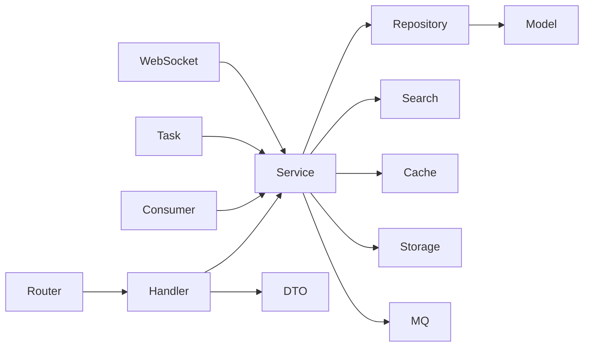

# 项目结构设计

## 1. 文档目的

本文规划新 CampusHub 后端的目录结构、包职责和依赖规则。本文只描述结构，不包含业务代码实现。

## 2. 设计原则

1. 采用模块化单体。
2. 按技术分层和业务域组织代码。
3. HTTP、WebSocket、Kafka Consumer、Cron Task 共用 Service 层。
4. 业务实体、请求 DTO、响应 DTO 分离。
5. 基础设施能力通过内部接口封装。
6. 数据库迁移文件独立管理。
7. 部署文件和配置文件不与业务代码混杂。

## 3. 推荐目录结构

```text
campus-hub/
├── cmd/
│   ├── server/
│   │   └── main.go
│   ├── migrate/
│   │   └── main.go
│   └── reindex/
│       └── main.go
├── configs/
│   ├── config.dev.yaml
│   ├── config.test.yaml
│   └── config.prod.yaml
├── internal/
│   ├── config/
│   ├── router/
│   ├── handler/
│   │   ├── auth/
│   │   ├── user/
│   │   ├── activity/
│   │   ├── registration/
│   │   ├── ticket/
│   │   ├── checkin/
│   │   ├── group/
│   │   ├── message/
│   │   ├── notification/
│   │   ├── file/
│   │   └── health/
│   ├── middleware/
│   ├── service/
│   │   ├── auth/
│   │   ├── user/
│   │   ├── activity/
│   │   ├── registration/
│   │   ├── ticket/
│   │   ├── checkin/
│   │   ├── group/
│   │   ├── message/
│   │   ├── notification/
│   │   ├── verification/
│   │   ├── credit/
│   │   └── file/
│   ├── repository/
│   │   ├── user/
│   │   ├── activity/
│   │   ├── registration/
│   │   ├── ticket/
│   │   ├── checkin/
│   │   ├── group/
│   │   ├── message/
│   │   ├── notification/
│   │   └── file/
│   ├── model/
│   ├── dto/
│   ├── ws/
│   ├── search/
│   ├── cache/
│   ├── storage/
│   ├── mq/
│   ├── consumer/
│   ├── tasks/
│   ├── event/
│   └── pkg/
├── migrations/
│   └── mysql/
├── deploy/
│   └── docker/
├── docs/
│   └── system_design/
├── scripts/
├── go.mod
└── go.sum
```

## 4. 顶层目录职责

### 4.1 `cmd/`

存放程序入口。

建议包含：

- `cmd/server`：启动 HTTP、WebSocket、消费者和定时任务；
- `cmd/migrate`：执行数据库迁移；
- `cmd/reindex`：执行 Elasticsearch 全量重建。

入口只负责组装依赖和启动程序，不写业务规则。

### 4.2 `configs/`

存放不同环境的 YAML 配置：

- 开发环境；
- 测试环境；
- 生产环境。

敏感信息不直接写入配置文件，生产环境通过环境变量注入。

### 4.3 `internal/`

存放后端核心代码，不对外暴露为可复用包。

### 4.4 `migrations/`

存放版本化数据库迁移文件。

建议按顺序编号，例如：

```text
000001_init_schema.up.sql
000001_init_schema.down.sql
```

### 4.5 `deploy/`

存放部署相关文件，例如：

- Dockerfile；
- docker-compose；
- 容器配置；
- 部署脚本。

### 4.6 `docs/`

存放项目文档。系统设计文档位于：

```text
docs/system_design/
```

### 4.7 `scripts/`

存放开发、测试、数据修复或本地工具脚本。

## 5. internal 子目录职责

### 5.1 `internal/config`

职责：

- 定义配置结构体；
- 使用 Viper 加载配置；
- 校验必要配置；
- 提供默认值。

### 5.2 `internal/router`

职责：

- 初始化 Gin Engine；
- 注册中间件；
- 注册各业务 Handler 路由；
- 注册健康检查；
- 注册兼容旧路径的临时路由。

### 5.3 `internal/handler`

职责：

- 接收请求；
- 绑定参数；
- 调用参数校验；
- 调用 Service；
- 返回统一响应。

不允许直接调用 GORM。

### 5.4 `internal/middleware`

职责：

- JWT 认证；
- CORS；
- 限流；
- 请求 ID；
- 日志；
- Recovery；
- 权限校验；
- WebSocket 相关握手校验。

### 5.5 `internal/service`

职责：

- 业务规则；
- 事务控制；
- 权限判断；
- 事件发布；
- 缓存更新；
- 调用 Repository、Search、Storage、MQ。

Service 是核心业务层。

### 5.6 `internal/repository`

职责：

- 封装 GORM；
- 提供数据查询和写入方法；
- 管理数据库锁；
- 返回业务模型。

不处理 HTTP 状态码。

### 5.7 `internal/model`

职责：

- 定义数据库实体；
- 定义实体关联；
- 定义表名和基础字段。

Model 不直接包含请求参数标签。

### 5.8 `internal/dto`

职责：

- 请求 DTO；
- 响应 DTO；
- 分页结构；
- 枚举展示结构。

DTO 不直接映射数据库表。

### 5.9 `internal/ws`

职责：

- WebSocket 连接管理；
- 客户端认证；
- 心跳；
- 房间订阅；
- 消息发送；
- 在线状态；
- 多实例消息转发。

### 5.10 `internal/search`

职责：

- Elasticsearch 客户端初始化；
- 索引名和别名管理；
- 搜索查询构造；
- 索引写入；
- 全量重建；
- 搜索结果转换。

### 5.11 `internal/cache`

职责：

- Redis 操作封装；
- Ristretto 本地缓存封装；
- Key 构造；
- TTL 管理；
- 缓存失效；
- singleflight 回源。

### 5.12 `internal/storage`

职责：

- 文件上传；
- 文件访问 URL；
- 文件删除；
- RustFS、OSS、COS 适配；
- 文件元数据组装。

### 5.13 `internal/mq`

职责：

- Kafka Producer 封装；
- Topic 和事件结构；
- 消息发送；
- Header 传递；
- Outbox Relay。

### 5.14 `internal/consumer`

职责：

- Kafka Reader 初始化；
- 消费者组管理；
- 消费事件；
- 调用 Service；
- 重试和错误处理。

建议按任务拆分：

- 搜索索引消费者；
- 通知消费者；
- 统计消费者；
- 审计消费者。

### 5.15 `internal/tasks`

职责：

- 定时任务注册；
- 活动状态流转；
- 票据过期处理；
- 学生认证超时；
- Outbox 扫描；
- 统计任务。

多实例环境必须使用 Redis 锁。

### 5.16 `internal/event`

职责：

- 领域事件定义；
- Outbox 事件结构；
- 事件类型常量；
- 事件序列化和反序列化。

### 5.17 `internal/pkg`

存放项目内部通用工具。

例如：

- 密码哈希；
- JWT；
- 分页；
- 时间处理；
- 响应封装；
- 错误码；
- 加密工具。

如果某个工具未来需要被其他项目复用，再移动到仓库根目录的公共包位置。

## 6. 依赖方向

推荐依赖方向：



禁止方向：

- Repository 调用 Service；
- Repository 调用 Handler；
- Handler 直接访问数据库；
- Model 依赖 HTTP Context；
- WebSocket 绕过 Service 执行业务写入；
- Consumer 直接拼接 SQL。

## 7. 业务模块划分

建议在 Handler、Service、Repository 三层保持一致的业务模块命名：

- `auth`；
- `user`；
- `activity`；
- `registration`；
- `ticket`；
- `checkin`；
- `group`；
- `message`；
- `notification`；
- `verification`；
- `credit`；
- `file`。

## 8. 运行模式规划

`cmd/server` 可通过配置控制运行组件：

| 组件 | 是否默认启动 | 说明 |
|---|---|---|
| HTTP Server | 是 | 提供 API |
| WebSocket Server | 是 | 提供实时连接 |
| Kafka Consumers | 是 | 可按消费者开关控制 |
| Cron Tasks | 是 | 多实例下通过锁避免重复 |
| Outbox Relay | 是 | 可独立部署，也可嵌入后端 |

如果部署规模增加，可以将 Consumer、Outbox Relay、Cron Worker 拆为独立进程，但目录和业务 Service 不需要大改。

## 9. 结构约束

1. 业务代码不得散落在仓库根目录。
2. 一个文件只承担一个清晰职责，避免超大 `utils.go`。
3. 所有外部请求结构体放在 DTO，不直接复用数据库 Model。
4. 所有外部依赖客户端必须通过构造函数注入。
5. 配置不得在业务代码中硬编码。
6. 测试文件应紧邻对应包，或集中在独立测试目录，具体按团队规范执行。
7. 临时兼容旧接口的代码必须集中管理并标注废弃时间。
