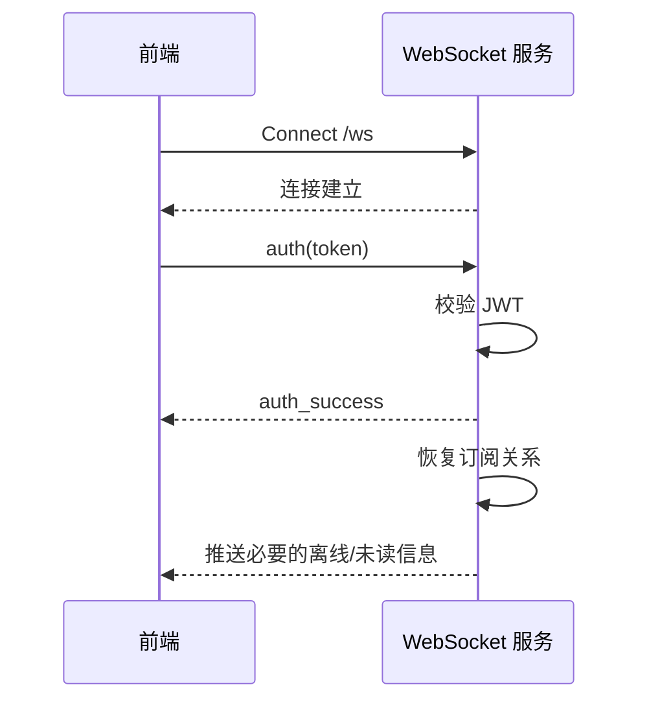
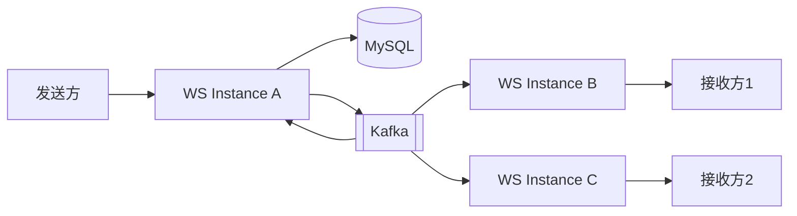

# WebSocket 协议设计

## 1. 文档目的

本文定义 CampusHub WebSocket 的连接方式、认证方式、消息信封、事件类型、心跳重连、消息确认、在线状态、多实例路由和异常处理。

## 2. 使用场景

WebSocket 用于：

- 活动群实时聊天；
- 系统通知实时推送；
- 学生认证进度推送；
- 用户在线状态；
- 消息投递确认；
- 未来活动状态变更提醒。

WebSocket 不承担：

- 业务数据唯一存储；
- 报名名额扣减；
- 票据状态唯一判断；
- 复杂历史消息查询。

## 3. 连接地址

推荐路径：

```text
/ws
```

完整地址示例：

```text
ws://localhost/ws
wss://api.example.com/ws
```

保留 `/ws` 是为了兼容前端当前默认连接方式，并方便 Nginx 或网关转发。

## 4. 连接与认证流程

### 4.1 推荐认证方式

客户端先建立连接，再发送认证消息。



### 4.2 认证消息

客户端发送：

```json
{
  "type": "auth",
  "message_id": "client-message-id",
  "timestamp": 1767232800000,
  "data": {
    "token": "<access_token>"
  }
}
```

认证成功：

```json
{
  "type": "auth_success",
  "message_id": "server-message-id",
  "timestamp": 1767232800100,
  "data": {
    "user_id": "user-uuid"
  }
}
```

认证失败：

```json
{
  "type": "auth_failed",
  "message_id": "server-message-id",
  "timestamp": 1767232800100,
  "data": {
    "code": 101401,
    "message": "认证失败"
  }
}
```

### 4.3 认证约束

- 连接建立后必须在限定时间内完成认证；
- 未认证连接不能发送业务消息；
- 认证失败或超时后服务端关闭连接；
- Token 过期后客户端应刷新 Token 并重新连接；
- 服务端应校验连接来源 Origin。

## 5. 消息信封

所有消息使用统一结构：

```json
{
  "type": "event_name",
  "message_id": "unique-message-id",
  "timestamp": 1767232800000,
  "trace_id": "trace-id",
  "data": {}
}
```

字段说明：

| 字段 | 必填 | 说明 |
|---|---|---|
| `type` | 是 | 事件类型 |
| `message_id` | 是 | 消息唯一 ID，客户端或服务端生成 |
| `timestamp` | 是 | Unix 毫秒时间戳 |
| `trace_id` | 否 | 链路追踪 ID |
| `data` | 否 | 事件数据 |

## 6. 心跳机制

### 6.1 客户端发送

```json
{
  "type": "ping",
  "message_id": "ping-001",
  "timestamp": 1767232800000
}
```

### 6.2 服务端响应

```json
{
  "type": "pong",
  "message_id": "pong-001",
  "timestamp": 1767232800000
}
```

建议：

- 心跳间隔 30 到 54 秒；
- 连续 2 次未收到 pong 判定连接异常；
- 客户端主动关闭并重新建立连接。

## 7. 客户端事件

### 7.1 发送群消息

文字消息：

```json
{
  "type": "send_message",
  "message_id": "client-msg-001",
  "timestamp": 1767232800000,
  "data": {
    "group_id": "group-uuid",
    "msg_type": 1,
    "content": "你好"
  }
}
```

图片消息：

```json
{
  "type": "send_message",
  "message_id": "client-msg-002",
  "timestamp": 1767232800000,
  "data": {
    "group_id": "group-uuid",
    "msg_type": 2,
    "image_file_id": "file-uuid"
  }
}
```

> 图片消息传 `image_file_id`（由图片上传接口返回），与文件存储约定一致：只存文件 ID，展示时由服务端现签 URL，避免预签名 URL 落库或长期外泄。

处理规则：

1. 校验用户是否属于该群；
2. 消息先落 MySQL；
3. 返回 ACK；
4. 通过 Kafka 的实例独立消费者组广播到其他实例；
5. 向群内其他成员推送 `new_message`。

> **实现状态（阶段 5）**：已实现 `auth`/`auth_success`/`auth_failed`、`ping`/`pong`、`send_message`/`ack`/`new_message`、`mark_read`、`error` 与连接后的房间恢复；`send_message` 用 `client_message_id` 幂等（同一 ID 重发返回原消息）。聊天消息落库后直接写 `campushub.chat.events.v1`；通知、学生认证与报名状态仍按 outbox 可靠发布。各实例分别使用 `campushub.chat-delivery.{instance_id}` 与 `campushub.realtime-delivery.{instance_id}` 消费组向本机连接投递，`notification`、`verify_progress`、`registration_status_changed` 均已实现；离线结果通过 HTTP 查询补齐。

### 7.2 标记已读

```json
{
  "type": "mark_read",
  "message_id": "client-read-001",
  "timestamp": 1767232800000,
  "data": {
    "group_id": "group-uuid",
    "message_id": "message-uuid"
  }
}
```

服务端更新该用户在该群的已读位置和未读计数。

## 8. 服务端事件

### 8.1 ACK

```json
{
  "type": "ack",
  "message_id": "server-ack-001",
  "timestamp": 1767232800000,
  "data": {
    "client_message_id": "client-msg-001",
    "server_message_id": "server-msg-001"
  }
}
```

ACK 用于确认客户端消息已被服务端接收并完成必要持久化。

### 8.2 新消息

```json
{
  "type": "new_message",
  "message_id": "server-msg-001",
  "timestamp": 1767232800000,
  "data": {
    "message_id": "server-msg-001",
    "group_id": "group-uuid",
    "sender_id": "user-uuid",
    "sender_name": "张三",
    "sender_avatar": "https://example.com/avatar.jpg",
    "msg_type": 1,
    "content": "你好",
    "created_at": 1767232800000
  }
}
```

### 8.3 通知

```json
{
  "type": "notification",
  "message_id": "notification-001",
  "timestamp": 1767232800000,
  "data": {
    "notification_id": "notification-uuid",
    "notification_type": "system",
    "title": "通知标题",
    "content": "通知内容",
    "created_at": 1767232800000
  }
}
```

### 8.4 学生认证进度

```json
{
  "type": "verify_progress",
  "message_id": "verify-001",
  "timestamp": 1767232800000,
  "data": {
    "verification_id": "verification-uuid",
    "status": "pending_confirm",
    "progress": 60,
    "message": "OCR 识别完成，请确认"
  }
}
```

### 8.5 报名状态变化

```json
{
  "type": "registration_status_changed",
  "message_id": "registration-001",
  "timestamp": 1767232800000,
  "data": {
    "registration_id": "registration-uuid",
    "activity_id": "activity-uuid",
    "from_status": "pending",
    "to_status": "approved",
    "ticket_id": "ticket-uuid",
    "group_id": "group-uuid",
    "message": "报名已通过"
  }
}
```

### 8.6 错误

```json
{
  "type": "error",
  "message_id": "error-001",
  "timestamp": 1767232800000,
  "data": {
    "code": 104003,
    "message": "无权访问该群"
  }
}
```

## 9. 事件类型清单

### 9.1 客户端到服务端

| 事件 | 说明 |
|---|---|
| `auth` | 连接认证 |
| `ping` | 心跳 |
| `send_message` | 发送群消息 |
| `mark_read` | 标记群消息已读 |

### 9.2 服务端到客户端

| 事件 | 说明 |
|---|---|
| `auth_success` | 认证成功 |
| `auth_failed` | 认证失败 |
| `pong` | 心跳响应 |
| `ack` | 客户端消息确认 |
| `new_message` | 新群消息 |
| `notification` | 系统通知 |
| `verify_progress` | 学生认证进度 |
| `registration_status_changed` | 报名审批、拒绝、取消或超时状态变化 |
| `error` | 错误事件 |

## 10. 断线重连

客户端重连规则：

1. 使用指数退避，例如 1 秒、2 秒、4 秒、8 秒；
2. 设置最大重连间隔，例如 30 秒；
3. 重连成功后重新认证；
4. 认证通过后恢复群组订阅；
5. 使用 HTTP 接口补齐断线期间消息；
6. 未确认的消息可在重连后根据客户端消息 ID 重试。

服务端应保证：

- 消息已落库；
- 重复消息可识别；
- 离线消息可查询；
- 未读计数可恢复。

## 11. 多实例路由

后端部署多个实例时，用户连接分散在不同实例。

### 11.1 Redis 保存连接信息

建议 Key：

- `ws:online:{user_id}`；
- `ws:user-connections:{user_id}`；
- `ws:connection:{connection_id}`；
- `ws:group-members:{group_id}`。

### 11.2 跨实例广播

Kafka 作为主广播机制，Redis 只用于在线状态、连接定位和房间关系。每个运行实例使用独立的消费者组，例如 `campushub.chat-delivery.{instance_id}`（群消息）和 `campushub.realtime-delivery.{instance_id}`（通知、认证、报名状态），确保每个实例都能收到全部相关投递事件；同一实例内的消费者仍可通过组内分工扩展。



## 12. 房间订阅

认证成功后，服务端根据用户所属群恢复订阅：

1. 查询用户有效群成员关系；
2. 将连接加入对应房间；
3. 保存用户连接与房间关系；
4. 后续群消息按房间投递。

用户取消报名或退出群后，应移除对应房间订阅。

活动群成员关系由报名的审批结果驱动：活动审核通过发布时创建群并把组织者写入为群主；报名审批通过后加入群，报名取消、拒绝或超时后退出群。该同步由 `campushub.chat-membership` 消费者组订阅 `campushub.registration.events.v1` 完成（见 Kafka 设计文档 §8.1）。

## 13. 离线消息

用户不在线时：

- 群消息正常落库；
- 通知正常落库；
- Redis 维护未读计数；
- 用户重连后通过 HTTP 拉取历史消息；
- WebSocket 可推送未读数量变化，但不把离线消息只放在内存队列。

## 14. 连接关闭策略

服务端可在以下情况关闭连接：

- 认证超时；
- 认证失败；
- Token 无效；
- 消息格式错误且无法恢复；
- 心跳长时间丢失；
- 服务优雅停机。

服务优雅停机时：

1. 停止接收新连接；
2. 通知客户端即将断开；
3. 等待进行中的消息处理完成；
4. 关闭连接；
5. 客户端重连到其他实例。

## 15. 安全要求

- 校验 Origin；
- 认证后才能订阅房间；
- 每次发消息都校验群成员关系；
- 限制单用户连接数和消息发送频率；
- 限制单条消息大小；
- 图片消息只接收合法 URL 或已上传文件 ID；
- 记录异常连接和高频发送行为。

## 16. 协议演进规则

1. 事件类型必须版本化或保持向后兼容。
2. 新增可选字段不得破坏旧客户端。
3. 删除事件前必须完成前端版本替换。
4. 消息结构变更必须更新本文档。
5. 客户端应忽略未知但合法的事件字段。
