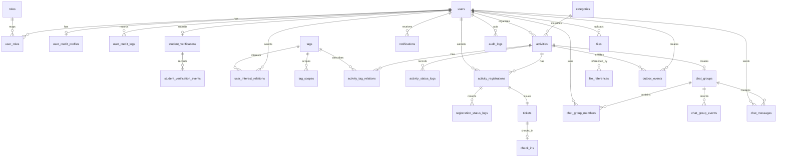

# 数据库设计

## 1. 文档目的

本文从 CampusHub 的业务语义出发重新设计数据库，不直接照搬旧仓库 SQL。设计重点包括：领域边界、状态流转、唯一约束、高频查询索引、审计追踪、事件可靠投递、文件引用和后续扩展能力。

## 2. 设计原则

1. MySQL 是唯一业务事实来源。
2. 新系统使用一个逻辑数据库 `campushub`。
3. 使用 InnoDB、`utf8mb4` 字符集和 `utf8mb4_0900_ai_ci` 排序规则。
4. 所有核心表使用 `BIGINT UNSIGNED` 自增主键。
5. 对外交互使用 UUID、业务编码或票据码，内部自增 ID 不作为唯一外部标识。
6. 时间字段统一使用 `DATETIME(3)`。
7. 聚合根允许少量展示冗余字段，但必须有事件或定时任务补偿。
8. 状态变更必须可追踪。
9. 生产环境使用版本化迁移文件，不依赖 GORM AutoMigrate 管理正式表结构。
10. 不使用会增加分库分表和迁移成本的物理外键，关系完整性通过事务、唯一索引、应用校验和补偿任务保证。

## 3. 通用字段规范

### 3.1 聚合根通用字段

| 字段 | 类型 | 说明 |
|---|---|---|
| `id` | BIGINT UNSIGNED | 自增主键 |
| `uuid` | CHAR(36) | 外部唯一标识 |
| `created_at` | DATETIME(3) | 创建时间 |
| `updated_at` | DATETIME(3) | 更新时间 |
| `deleted_at` | DATETIME(3) | 软删除时间，仅聚合根使用 |

### 3.2 日志类表

日志、事件、流水类表只追加，不更新、不软删除，至少包含：

- `id`；
- 业务关联 ID；
- `event_type` 或操作类型；
- `created_at`；
- `trace_id`，如适用。

## 4. 表总览

| 领域 | 表 |
|---|---|
| 身份与权限 | `users`、`roles`、`user_roles` |
| 信用 | `user_credit_profiles`、`user_credit_logs` |
| 学生认证 | `student_verifications`、`student_verification_events` |
| 分类标签 | `categories`、`tags`、`tag_scopes`、`user_interest_relations` |
| 活动 | `activities`、`activity_tag_relations`、`activity_status_logs` |
| 报名票据 | `activity_registrations`、`registration_status_logs`、`tickets`、`check_ins` |
| 聊天通知 | `chat_groups`、`chat_group_members`、`chat_group_events`、`chat_messages`、`notifications` |
| 文件 | `files`、`file_references` |
| 系统能力 | `outbox_events`、`idempotency_records`、`audit_logs` |

## 5. ER 图

## 6. 身份与权限表

### 6.1 `users`

用户聚合根。

| 字段 | 类型 | 约束 | 说明 |
|---|---|---|---|
| `id` | BIGINT UNSIGNED | PK, AUTO_INCREMENT | 用户 ID |
| `uuid` | CHAR(36) | NOT NULL, UNIQUE | 外部用户标识 |
| `email` | VARCHAR(100) | NOT NULL, UNIQUE | 登录邮箱，存储前做小写和去空格处理 |
| `password_hash` | VARCHAR(255) | NOT NULL | 密码哈希 |
| `nickname` | VARCHAR(50) | NOT NULL | 昵称 |
| `avatar_file_id` | BIGINT UNSIGNED | NULL | 头像文件 ID |
| `avatar_url` | VARCHAR(500) | NOT NULL DEFAULT '' | 头像 URL 冗余 |
| `introduction` | VARCHAR(500) | NOT NULL DEFAULT '' | 个人简介 |
| `gender` | TINYINT UNSIGNED | NOT NULL DEFAULT 0 | 0 未知，1 男，2 女 |
| `birthday` | DATE | NULL | 生日，年龄由业务层计算，不直接存储易过期的年龄 |
| `status` | TINYINT UNSIGNED | NOT NULL DEFAULT 1 | 0 禁用，1 正常，2 锁定，3 已注销 |
| `last_login_at` | DATETIME(3) | NULL | 最后登录时间 |
| `created_at` | DATETIME(3) | NOT NULL | 创建时间 |
| `updated_at` | DATETIME(3) | NOT NULL | 更新时间 |
| `deleted_at` | DATETIME(3) | NULL | 软删除时间 |

索引：

- UNIQUE KEY `uk_email` (`email`)；
- UNIQUE KEY `uk_uuid` (`uuid`)；
- KEY `idx_status_deleted` (`status`, `deleted_at`)。

账号注销默认采用状态标记和敏感信息脱敏，不立即物理删除；如需要彻底删除，通过归档任务处理。

### 6.2 `roles`

| 字段 | 类型 | 约束 | 说明 |
|---|---|---|---|
| `id` | BIGINT UNSIGNED | PK | 角色 ID |
| `code` | VARCHAR(50) | NOT NULL, UNIQUE | 角色编码，例如 `user`、`admin` |
| `name` | VARCHAR(50) | NOT NULL | 角色名称 |
| `description` | VARCHAR(200) | NOT NULL DEFAULT '' | 描述 |
| `created_at` | DATETIME(3) | NOT NULL | 创建时间 |
| `updated_at` | DATETIME(3) | NOT NULL | 更新时间 |

### 6.3 `user_roles`

| 字段 | 类型 | 约束 | 说明 |
|---|---|---|---|
| `id` | BIGINT UNSIGNED | PK | 主键 |
| `user_id` | BIGINT UNSIGNED | NOT NULL | 用户 ID |
| `role_id` | BIGINT UNSIGNED | NOT NULL | 角色 ID |
| `created_at` | DATETIME(3) | NOT NULL | 创建时间 |

索引：

- UNIQUE KEY `uk_user_role` (`user_id`, `role_id`)；
- KEY `idx_role_id` (`role_id`)。

## 7. 信用表

### 7.1 `user_credit_profiles`

| 字段 | 类型 | 约束 | 说明 |
|---|---|---|---|
| `user_id` | BIGINT UNSIGNED | PK | 用户 ID |
| `score` | INT | NOT NULL DEFAULT 100 | 当前信用分 |
| `level` | TINYINT | NOT NULL DEFAULT 4 | 信用等级 |
| `created_at` | DATETIME(3) | NOT NULL | 创建时间 |
| `updated_at` | DATETIME(3) | NOT NULL | 更新时间 |

### 7.2 `user_credit_logs`

信用流水，只追加。

| 字段 | 类型 | 约束 | 说明 |
|---|---|---|---|
| `id` | BIGINT UNSIGNED | PK | 主键 |
| `uuid` | CHAR(36) | NOT NULL, UNIQUE | 流水 UUID |
| `user_id` | BIGINT UNSIGNED | NOT NULL | 用户 ID |
| `change_type` | TINYINT | NOT NULL | 1 加分，2 扣分 |
| `source_type` | VARCHAR(50) | NOT NULL | 来源类型，例如 activity、verification、admin |
| `source_id` | VARCHAR(128) | NOT NULL | 来源业务 ID |
| `before_score` | INT | NOT NULL | 变更前分数 |
| `after_score` | INT | NOT NULL | 变更后分数 |
| `delta` | INT | NOT NULL | 变更值 |
| `reason` | VARCHAR(255) | NOT NULL DEFAULT '' | 原因 |
| `trace_id` | VARCHAR(64) | NOT NULL DEFAULT '' | 链路 ID |
| `created_at` | DATETIME(3) | NOT NULL | 创建时间 |

索引：

- UNIQUE KEY `uk_user_source` (`user_id`, `source_type`, `source_id`)；
- KEY `idx_user_created` (`user_id`, `created_at`)。

## 8. 学生认证表

### 8.1 `student_verifications`

一个用户对应一条当前认证聚合；历史过程通过事件表保存。申请本身提供独立的内部 ID 和外部 UUID，供 API、WebSocket 和事件引用。

| 字段 | 类型 | 约束 | 说明 |
|---|---|---|---|
| `id` | BIGINT UNSIGNED | PK, AUTO_INCREMENT | 认证申请内部 ID |
| `uuid` | CHAR(36) | NOT NULL, UNIQUE | 对外认证申请标识 |
| `user_id` | BIGINT UNSIGNED | NOT NULL, UNIQUE | 用户 ID，当前认证聚合唯一 |
| `status` | TINYINT | NOT NULL DEFAULT 0 | 认证状态 |
| `real_name_encrypted` | VARCHAR(255) | NULL | 加密真实姓名 |
| `school_name` | VARCHAR(100) | NULL | 学校名称 |
| `student_id_encrypted` | VARCHAR(255) | NULL | 加密学号 |
| `student_id_hash` | VARCHAR(64) | NOT NULL DEFAULT '' | 学号哈希 |
| `department` | VARCHAR(100) | NULL | 院系 |
| `admission_year` | VARCHAR(10) | NULL | 入学年份 |
| `front_file_id` | BIGINT UNSIGNED | NULL | 学生证正面文件 |
| `back_file_id` | BIGINT UNSIGNED | NULL | 学生证详情面文件 |
| `ocr_platform` | VARCHAR(20) | NOT NULL DEFAULT '' | OCR 平台 |
| `ocr_confidence` | DECIMAL(5,2) | NULL | 置信度 |
| `ocr_raw_json` | JSON | NULL | OCR 原始结果 |
| `reject_reason` | VARCHAR(255) | NOT NULL DEFAULT '' | 拒绝原因 |
| `cancel_reason` | VARCHAR(255) | NOT NULL DEFAULT '' | 取消原因 |
| `reviewer_id` | BIGINT UNSIGNED | NULL | 审核人 |
| `submitted_at` | DATETIME(3) | NULL | 提交时间 |
| `ocr_completed_at` | DATETIME(3) | NULL | OCR 完成时间 |
| `reviewed_at` | DATETIME(3) | NULL | 审核完成时间 |
| `verified_at` | DATETIME(3) | NULL | 认证通过时间 |
| `created_at` | DATETIME(3) | NOT NULL | 创建时间 |
| `updated_at` | DATETIME(3) | NOT NULL | 更新时间 |

可增加生成列 `approved_identity_key`：当状态为 approved 时生成 `school_name#student_id_hash`，其他状态为 NULL，并对该列建立唯一索引，避免同一学生被重复认证，同时不阻塞拒绝或取消后的重新申请。

索引：

- UNIQUE KEY `uk_uuid` (`uuid`)；
- UNIQUE KEY `uk_user` (`user_id`)；
- KEY `idx_status_updated` (`status`, `updated_at`)。

### 8.2 `student_verification_events`

| 字段 | 类型 | 约束 | 说明 |
|---|---|---|---|
| `id` | BIGINT UNSIGNED | PK | 主键 |
| `uuid` | CHAR(36) | NOT NULL, UNIQUE | 事件 UUID |
| `verification_id` | BIGINT UNSIGNED | NOT NULL | 认证申请内部 ID |
| `user_id` | BIGINT UNSIGNED | NOT NULL | 用户 ID |
| `from_status` | TINYINT | NOT NULL | 原状态 |
| `to_status` | TINYINT | NOT NULL | 新状态 |
| `event_type` | VARCHAR(80) | NOT NULL | 事件类型 |
| `operator_id` | BIGINT UNSIGNED | NOT NULL DEFAULT 0 | 操作人 |
| `operator_type` | TINYINT | NOT NULL DEFAULT 1 | 1 用户，2 管理员，3 系统 |
| `reason` | VARCHAR(500) | NOT NULL DEFAULT '' | 原因 |
| `metadata` | JSON | NULL | 附加信息 |
| `trace_id` | VARCHAR(64) | NOT NULL DEFAULT '' | 链路 ID |
| `created_at` | DATETIME(3) | NOT NULL | 创建时间 |

索引：

- KEY `idx_verification_created` (`verification_id`, `created_at`)；
- KEY `idx_user_created` (`user_id`, `created_at`)。

## 9. 分类与标签表

### 9.1 `categories`

| 字段 | 类型 | 约束 | 说明 |
|---|---|---|---|
| `id` | BIGINT UNSIGNED | PK | 分类 ID |
| `name` | VARCHAR(50) | NOT NULL, UNIQUE | 分类名称 |
| `icon` | VARCHAR(100) | NOT NULL DEFAULT '' | 图标 |
| `sort` | INT | NOT NULL DEFAULT 0 | 排序，越大越靠前 |
| `status` | TINYINT | NOT NULL DEFAULT 1 | 1 启用，0 禁用 |
| `created_at` | DATETIME(3) | NOT NULL | 创建时间 |
| `updated_at` | DATETIME(3) | NOT NULL | 更新时间 |

### 9.2 `tags`

标签是全局实体，不再重复建设兴趣标签表和活动标签表。

| 字段 | 类型 | 约束 | 说明 |
|---|---|---|---|
| `id` | BIGINT UNSIGNED | PK | 标签 ID |
| `name` | VARCHAR(50) | NOT NULL, UNIQUE | 标签名称 |
| `slug` | VARCHAR(80) | NOT NULL, UNIQUE | URL 友好标识 |
| `color` | VARCHAR(20) | NOT NULL DEFAULT '' | 颜色 |
| `icon` | VARCHAR(255) | NOT NULL DEFAULT '' | 图标 |
| `description` | VARCHAR(200) | NOT NULL DEFAULT '' | 描述 |
| `status` | TINYINT | NOT NULL DEFAULT 1 | 1 启用，0 禁用 |
| `created_at` | DATETIME(3) | NOT NULL | 创建时间 |
| `updated_at` | DATETIME(3) | NOT NULL | 更新时间 |

### 9.3 `tag_scopes`

定义标签适用于兴趣还是活动，并保存分场景统计。

| 字段 | 类型 | 约束 | 说明 |
|---|---|---|---|
| `id` | BIGINT UNSIGNED | PK | 主键 |
| `tag_id` | BIGINT UNSIGNED | NOT NULL | 标签 ID |
| `scope` | VARCHAR(20) | NOT NULL | `interest` 或 `activity` |
| `status` | TINYINT | NOT NULL DEFAULT 1 | 1 启用，0 禁用 |
| `usage_count` | INT UNSIGNED | NOT NULL DEFAULT 0 | 使用次数 |
| `view_count` | BIGINT UNSIGNED | NOT NULL DEFAULT 0 | 浏览次数 |
| `created_at` | DATETIME(3) | NOT NULL | 创建时间 |
| `updated_at` | DATETIME(3) | NOT NULL | 更新时间 |

索引：

- UNIQUE KEY `uk_tag_scope` (`tag_id`, `scope`)；
- KEY `idx_scope_status_usage` (`scope`, `status`, `usage_count`)。

### 9.4 `user_interest_relations`

| 字段 | 类型 | 约束 | 说明 |
|---|---|---|---|
| `id` | BIGINT UNSIGNED | PK | 主键 |
| `user_id` | BIGINT UNSIGNED | NOT NULL | 用户 ID |
| `tag_id` | BIGINT UNSIGNED | NOT NULL | 兴趣标签 ID |
| `created_at` | DATETIME(3) | NOT NULL | 创建时间 |

索引：

- UNIQUE KEY `uk_user_tag` (`user_id`, `tag_id`)；
- KEY `idx_tag_id` (`tag_id`)。

## 10. 活动表

### 10.1 `activities`

活动聚合根。

| 字段 | 类型 | 约束 | 说明 |
|---|---|---|---|
| `id` | BIGINT UNSIGNED | PK | 活动 ID |
| `uuid` | CHAR(36) | NOT NULL, UNIQUE | 外部活动标识 |
| `title` | VARCHAR(100) | NOT NULL | 标题 |
| `cover_file_id` | BIGINT UNSIGNED | NULL | 封面文件 ID |
| `cover_url` | VARCHAR(500) | NOT NULL DEFAULT '' | 封面 URL |
| `cover_type` | TINYINT | NOT NULL DEFAULT 1 | 1 图片，2 视频 |
| `description` | MEDIUMTEXT | NULL | 活动详情 |
| `category_id` | BIGINT UNSIGNED | NOT NULL | 分类 ID |
| `organizer_id` | BIGINT UNSIGNED | NOT NULL | 组织者 ID |
| `organizer_name` | VARCHAR(50) | NOT NULL DEFAULT '' | 组织者名称冗余 |
| `organizer_avatar` | VARCHAR(500) | NOT NULL DEFAULT '' | 组织者头像冗余 |
| `contact_phone` | VARCHAR(20) | NOT NULL DEFAULT '' | 联系电话 |
| `register_start_at` | DATETIME(3) | NOT NULL | 报名开始时间 |
| `register_end_at` | DATETIME(3) | NOT NULL | 报名结束时间 |
| `activity_start_at` | DATETIME(3) | NOT NULL | 活动开始时间 |
| `activity_end_at` | DATETIME(3) | NOT NULL | 活动结束时间 |
| `location` | VARCHAR(200) | NOT NULL DEFAULT '' | 地点名称 |
| `address_detail` | VARCHAR(500) | NOT NULL DEFAULT '' | 详细地址 |
| `longitude` | DECIMAL(10,7) | NULL | 经度 |
| `latitude` | DECIMAL(10,7) | NULL | 纬度 |
| `max_participants` | INT UNSIGNED | NOT NULL DEFAULT 0 | 最大人数，0 不限 |
| `approved_participant_count` | INT UNSIGNED | NOT NULL DEFAULT 0 | 已通过报名人数 |
| `pending_participant_count` | INT UNSIGNED | NOT NULL DEFAULT 0 | 待审批人数 |
| `require_approval` | TINYINT(1) | NOT NULL DEFAULT 0 | 是否需要报名审批 |
| `require_student_verify` | TINYINT(1) | NOT NULL DEFAULT 0 | 是否要求学生认证 |
| `min_credit_score` | INT | NOT NULL DEFAULT 0 | 最低信用分 |
| `status` | TINYINT | NOT NULL DEFAULT 0 | 活动状态 |
| `reject_reason` | VARCHAR(500) | NOT NULL DEFAULT '' | 活动审核拒绝原因 |
| `view_count` | BIGINT UNSIGNED | NOT NULL DEFAULT 0 | 浏览量 |
| `like_count` | INT UNSIGNED | NOT NULL DEFAULT 0 | 点赞数 |
| `version` | INT UNSIGNED | NOT NULL DEFAULT 0 | 乐观锁版本 |
| `published_at` | DATETIME(3) | NULL | 发布时间 |
| `created_at` | DATETIME(3) | NOT NULL | 创建时间 |
| `updated_at` | DATETIME(3) | NOT NULL | 更新时间 |
| `deleted_at` | DATETIME(3) | NULL | 软删除时间 |

索引：

- KEY `idx_category_status_time` (`category_id`, `status`, `activity_start_at`)；
- KEY `idx_status_time` (`status`, `activity_start_at`, `activity_end_at`)；
- KEY `idx_organizer_status` (`organizer_id`, `status`)；
- KEY `idx_created_at` (`created_at`)；
- KEY `idx_deleted_at` (`deleted_at`)。

### 10.2 `activity_tag_relations`

| 字段 | 类型 | 约束 | 说明 |
|---|---|---|---|
| `id` | BIGINT UNSIGNED | PK | 主键 |
| `activity_id` | BIGINT UNSIGNED | NOT NULL | 活动 ID |
| `tag_id` | BIGINT UNSIGNED | NOT NULL | 标签 ID |
| `created_at` | DATETIME(3) | NOT NULL | 创建时间 |

索引：

- UNIQUE KEY `uk_activity_tag` (`activity_id`, `tag_id`)；
- KEY `idx_tag_id` (`tag_id`)。

### 10.3 `activity_status_logs`

| 字段 | 类型 | 约束 | 说明 |
|---|---|---|---|
| `id` | BIGINT UNSIGNED | PK | 主键 |
| `uuid` | CHAR(36) | NOT NULL, UNIQUE | 日志 UUID |
| `activity_id` | BIGINT UNSIGNED | NOT NULL | 活动 ID |
| `from_status` | TINYINT | NOT NULL | 原状态 |
| `to_status` | TINYINT | NOT NULL | 新状态 |
| `operator_id` | BIGINT UNSIGNED | NOT NULL DEFAULT 0 | 操作人 |
| `operator_type` | TINYINT | NOT NULL DEFAULT 1 | 1 用户，2 管理员，3 系统 |
| `reason` | VARCHAR(500) | NOT NULL DEFAULT '' | 原因 |
| `trace_id` | VARCHAR(64) | NOT NULL DEFAULT '' | 链路 ID |
| `created_at` | DATETIME(3) | NOT NULL | 创建时间 |

索引：

- KEY `idx_activity_created` (`activity_id`, `created_at`)。

## 11. 报名、票据与核销表

### 11.1 `activity_registrations`

每次报名申请一条记录。取消、拒绝或失败后允许重新报名，因此不能简单使用 `(activity_id,user_id)` 全状态唯一约束。

| 字段 | 类型 | 约束 | 说明 |
|---|---|---|---|
| `id` | BIGINT UNSIGNED | PK | 报名 ID |
| `uuid` | CHAR(36) | NOT NULL, UNIQUE | 外部报名标识 |
| `activity_id` | BIGINT UNSIGNED | NOT NULL | 活动 ID |
| `user_id` | BIGINT UNSIGNED | NOT NULL | 用户 ID |
| `status` | TINYINT | NOT NULL DEFAULT 1 | 报名状态 |
| `active_flag` | TINYINT | NULL | pending/approved 为 1，其他状态为 NULL |
| `expires_at` | DATETIME(3) | NULL | 待审批或待确认过期时间 |
| `reviewed_by` | BIGINT UNSIGNED | NULL | 审批人 |
| `decided_at` | DATETIME(3) | NULL | 审批决定时间 |
| `cancel_time` | DATETIME(3) | NULL | 取消时间 |
| `reject_reason` | VARCHAR(255) | NOT NULL DEFAULT '' | 拒绝原因 |
| `created_at` | DATETIME(3) | NOT NULL | 创建时间 |
| `updated_at` | DATETIME(3) | NOT NULL | 更新时间 |

索引：

- UNIQUE KEY `uk_active_registration` (`activity_id`, `user_id`, `active_flag`)；
- KEY `idx_user_status_created` (`user_id`, `status`, `created_at`)；
- KEY `idx_activity_status` (`activity_id`, `status`)；
- KEY `idx_expires_at` (`expires_at`)。

### 11.2 `registration_status_logs`

| 字段 | 类型 | 约束 | 说明 |
|---|---|---|---|
| `id` | BIGINT UNSIGNED | PK | 主键 |
| `registration_id` | BIGINT UNSIGNED | NOT NULL | 报名 ID |
| `from_status` | TINYINT | NOT NULL | 原状态 |
| `to_status` | TINYINT | NOT NULL | 新状态 |
| `operator_id` | BIGINT UNSIGNED | NOT NULL DEFAULT 0 | 操作人 |
| `operator_type` | TINYINT | NOT NULL DEFAULT 1 | 1 用户，2 组织者，3 管理员，4 系统 |
| `reason` | VARCHAR(500) | NOT NULL DEFAULT '' | 原因 |
| `trace_id` | VARCHAR(64) | NOT NULL DEFAULT '' | 链路 ID |
| `created_at` | DATETIME(3) | NOT NULL | 创建时间 |

索引：

- KEY `idx_registration_created` (`registration_id`, `created_at`)。

### 11.3 `tickets`

票据只在报名审批通过后生成；无需审批的活动在报名成功时生成。

| 字段 | 类型 | 约束 | 说明 |
|---|---|---|---|
| `id` | BIGINT UNSIGNED | PK | 票据 ID |
| `uuid` | CHAR(36) | NOT NULL, UNIQUE | 外部 UUID |
| `code` | VARCHAR(32) | NOT NULL, UNIQUE | 票据短码 |
| `registration_id` | BIGINT UNSIGNED | NOT NULL, UNIQUE | 报名 ID |
| `activity_id` | BIGINT UNSIGNED | NOT NULL | 活动 ID |
| `user_id` | BIGINT UNSIGNED | NOT NULL | 用户 ID |
| `status` | TINYINT | NOT NULL DEFAULT 0 | 票据状态 |
| `totp_secret` | VARCHAR(128) | NULL | TOTP 密钥，应加密存储 |
| `totp_enabled` | TINYINT(1) | NOT NULL DEFAULT 1 | 是否启用 TOTP |
| `valid_start_at` | DATETIME(3) | NULL | 可核销开始时间 |
| `valid_end_at` | DATETIME(3) | NULL | 可核销结束时间 |
| `issued_at` | DATETIME(3) | NOT NULL | 签发时间 |
| `used_at` | DATETIME(3) | NULL | 核销时间 |
| `voided_at` | DATETIME(3) | NULL | 作废时间 |
| `used_location` | VARCHAR(200) | NOT NULL DEFAULT '' | 核销地点 |
| `check_in_snapshot` | JSON | NULL | 核销快照 |
| `version` | INT UNSIGNED | NOT NULL DEFAULT 0 | 乐观锁版本 |
| `created_at` | DATETIME(3) | NOT NULL | 创建时间 |
| `updated_at` | DATETIME(3) | NOT NULL | 更新时间 |

索引：

- KEY `idx_user_status` (`user_id`, `status`)；
- KEY `idx_activity_status` (`activity_id`, `status`)。

### 11.4 `check_ins`

核销成功记录。一张票据只能成功核销一次。

| 字段 | 类型 | 约束 | 说明 |
|---|---|---|---|
| `id` | BIGINT UNSIGNED | PK | 主键 |
| `uuid` | CHAR(36) | NOT NULL, UNIQUE | 核销 UUID |
| `check_in_no` | VARCHAR(64) | NOT NULL, UNIQUE | 核销流水号 |
| `ticket_id` | BIGINT UNSIGNED | NOT NULL, UNIQUE | 票据 ID |
| `registration_id` | BIGINT UNSIGNED | NOT NULL | 报名 ID |
| `activity_id` | BIGINT UNSIGNED | NOT NULL | 活动 ID |
| `user_id` | BIGINT UNSIGNED | NOT NULL | 参与用户 ID |
| `operator_id` | BIGINT UNSIGNED | NOT NULL | 核销操作人 |
| `method` | TINYINT | NOT NULL | 1 二维码，2 TOTP，3 手动 |
| `checked_in_at` | DATETIME(3) | NOT NULL | 核销时间 |
| `longitude` | DECIMAL(10,7) | NULL | 经度 |
| `latitude` | DECIMAL(10,7) | NULL | 纬度 |
| `client_request_id` | VARCHAR(64) | NOT NULL, UNIQUE | 客户端幂等 ID |
| `snapshot` | JSON | NULL | 核销快照 |
| `created_at` | DATETIME(3) | NOT NULL | 创建时间 |

索引：

- KEY `idx_activity_created` (`activity_id`, `created_at`)；
- KEY `idx_user_created` (`user_id`, `created_at`)。

## 12. 聊天表

### 12.1 `chat_groups`

| 字段 | 类型 | 约束 | 说明 |
|---|---|---|---|
| `id` | BIGINT UNSIGNED | PK | 群 ID |
| `uuid` | CHAR(36) | NOT NULL, UNIQUE | 外部群 UUID |
| `activity_id` | BIGINT UNSIGNED | NOT NULL, UNIQUE | 活动 ID |
| `name` | VARCHAR(255) | NOT NULL | 群名称 |
| `cover_file_id` | BIGINT UNSIGNED | NULL | 群封面文件 |
| `cover_url` | VARCHAR(500) | NOT NULL DEFAULT '' | 群封面 URL |
| `owner_id` | BIGINT UNSIGNED | NOT NULL | 群主 |
| `status` | TINYINT | NOT NULL DEFAULT 1 | 1 正常，2 只读，3 解散 |
| `max_members` | INT | NOT NULL DEFAULT 0 | 最大成员，0 不限 |
| `member_count` | INT | NOT NULL DEFAULT 0 | 当前成员数 |
| `created_at` | DATETIME(3) | NOT NULL | 创建时间 |
| `updated_at` | DATETIME(3) | NOT NULL | 更新时间 |
| `deleted_at` | DATETIME(3) | NULL | 软删除时间 |

### 12.2 `chat_group_members`

一个用户在一个群中对应一条当前成员记录；退出后重新加入时更新该记录，历史通过群事件保存。

| 字段 | 类型 | 约束 | 说明 |
|---|---|---|---|
| `id` | BIGINT UNSIGNED | PK | 主键 |
| `group_id` | BIGINT UNSIGNED | NOT NULL | 群 ID |
| `user_id` | BIGINT UNSIGNED | NOT NULL | 用户 ID |
| `role` | TINYINT | NOT NULL DEFAULT 1 | 1 成员，2 群主 |
| `status` | TINYINT | NOT NULL DEFAULT 1 | 1 正常，2 已退出 |
| `joined_at` | DATETIME(3) | NOT NULL | 最近加入时间 |
| `left_at` | DATETIME(3) | NULL | 最近退出时间 |
| `last_read_message_id` | BIGINT UNSIGNED | NULL | 最后已读消息 |
| `muted` | TINYINT(1) | NOT NULL DEFAULT 0 | 是否免打扰 |
| `created_at` | DATETIME(3) | NOT NULL | 创建时间 |
| `updated_at` | DATETIME(3) | NOT NULL | 更新时间 |

索引：

- UNIQUE KEY `uk_group_user` (`group_id`, `user_id`)；
- KEY `idx_user_status` (`user_id`, `status`)。

### 12.3 `chat_group_events`

| 字段 | 类型 | 约束 | 说明 |
|---|---|---|---|
| `id` | BIGINT UNSIGNED | PK | 主键 |
| `uuid` | CHAR(36) | NOT NULL, UNIQUE | 事件 UUID |
| `group_id` | BIGINT UNSIGNED | NOT NULL | 群 ID |
| `user_id` | BIGINT UNSIGNED | NOT NULL | 相关用户 |
| `event_type` | VARCHAR(80) | NOT NULL | 成员加入、退出、角色变化、群解散等 |
| `metadata` | JSON | NULL | 附加信息 |
| `operator_id` | BIGINT UNSIGNED | NOT NULL DEFAULT 0 | 操作人 |
| `trace_id` | VARCHAR(64) | NOT NULL DEFAULT '' | 链路 ID |
| `created_at` | DATETIME(3) | NOT NULL | 创建时间 |

索引：

- KEY `idx_group_created` (`group_id`, `created_at`)；
- KEY `idx_user_created` (`user_id`, `created_at`)。

### 12.4 `chat_messages`

| 字段 | 类型 | 约束 | 说明 |
|---|---|---|---|
| `id` | BIGINT UNSIGNED | PK | 消息 ID |
| `uuid` | CHAR(36) | NOT NULL, UNIQUE | 外部消息 UUID |
| `group_id` | BIGINT UNSIGNED | NOT NULL | 群 ID |
| `sender_id` | BIGINT UNSIGNED | NOT NULL | 发送者 |
| `msg_type` | TINYINT | NOT NULL | 1 文本，2 图片，3 系统消息 |
| `content` | TEXT | NULL | 文本内容 |
| `image_file_id` | BIGINT UNSIGNED | NULL | 图片文件 ID |
| `image_url` | VARCHAR(500) | NOT NULL DEFAULT '' | 图片 URL |
| `status` | TINYINT | NOT NULL DEFAULT 1 | 1 正常，2 撤回 |
| `recalled_at` | DATETIME(3) | NULL | 撤回时间 |
| `created_at` | DATETIME(3) | NOT NULL | 创建时间 |

索引：

- KEY `idx_group_created` (`group_id`, `created_at`)；
- KEY `idx_sender_created` (`sender_id`, `created_at`)。

## 13. 通知表

### 13.1 `notifications`

| 字段 | 类型 | 约束 | 说明 |
|---|---|---|---|
| `id` | BIGINT UNSIGNED | PK | 通知 ID |
| `uuid` | CHAR(36) | NOT NULL, UNIQUE | 外部通知 UUID |
| `user_id` | BIGINT UNSIGNED | NOT NULL | 接收用户 |
| `type` | VARCHAR(32) | NOT NULL | 通知类型 |
| `title` | VARCHAR(255) | NOT NULL | 标题 |
| `content` | TEXT | NOT NULL | 内容 |
| `data` | JSON | NULL | 附加数据 |
| `is_read` | TINYINT(1) | NOT NULL DEFAULT 0 | 是否已读 |
| `read_at` | DATETIME(3) | NULL | 阅读时间 |
| `created_at` | DATETIME(3) | NOT NULL | 创建时间 |

索引：

- KEY `idx_user_created` (`user_id`, `created_at`)；
- KEY `idx_user_read` (`user_id`, `is_read`)。

通知不做软删除，按保留周期归档或清理。

## 14. 文件表

### 14.1 `files`

| 字段 | 类型 | 约束 | 说明 |
|---|---|---|---|
| `id` | BIGINT UNSIGNED | PK | 文件 ID |
| `uuid` | CHAR(36) | NOT NULL, UNIQUE | 外部文件 UUID |
| `storage_driver` | VARCHAR(20) | NOT NULL | rustfs、s3、oss、cos |
| `bucket` | VARCHAR(100) | NOT NULL | Bucket |
| `object_key` | VARCHAR(500) | NOT NULL | 对象 Key |
| `url` | VARCHAR(500) | NOT NULL | 访问 URL |
| `origin_name` | VARCHAR(255) | NOT NULL DEFAULT '' | 原始文件名 |
| `biz_type` | VARCHAR(32) | NOT NULL | avatar、activity_cover、student_card、chat_image |
| `file_size` | BIGINT UNSIGNED | NOT NULL DEFAULT 0 | 文件大小 |
| `mime_type` | VARCHAR(64) | NOT NULL DEFAULT '' | MIME 类型 |
| `extension` | VARCHAR(10) | NOT NULL DEFAULT '' | 后缀 |
| `sha256` | VARCHAR(64) | NOT NULL DEFAULT '' | 文件摘要 |
| `uploader_id` | BIGINT UNSIGNED | NOT NULL | 上传者 |
| `status` | TINYINT | NOT NULL DEFAULT 0 | 0 审核中，1 正常，2 封禁，3 待清理 |
| `metadata` | JSON | NULL | 宽高、处理结果等 |
| `created_at` | DATETIME(3) | NOT NULL | 创建时间 |
| `updated_at` | DATETIME(3) | NOT NULL | 更新时间 |
| `deleted_at` | DATETIME(3) | NULL | 软删除 |

索引：

- KEY `idx_uploader` (`uploader_id`)；
- KEY `idx_biz_status` (`biz_type`, `status`)；
- KEY `idx_sha256` (`sha256`)。

### 14.2 `file_references`

记录文件被哪个业务对象引用，避免只依赖不可靠的手动引用计数。

| 字段 | 类型 | 约束 | 说明 |
|---|---|---|---|
| `id` | BIGINT UNSIGNED | PK | 主键 |
| `file_id` | BIGINT UNSIGNED | NOT NULL | 文件 ID |
| `biz_type` | VARCHAR(32) | NOT NULL | 业务类型 |
| `biz_id` | BIGINT UNSIGNED | NOT NULL | 业务对象 ID |
| `created_by` | BIGINT UNSIGNED | NOT NULL | 创建人 |
| `created_at` | DATETIME(3) | NOT NULL | 创建时间 |
| `deleted_at` | DATETIME(3) | NULL | 引用解除时间 |

索引：

- UNIQUE KEY `uk_file_biz` (`file_id`, `biz_type`, `biz_id`)；
- KEY `idx_biz` (`biz_type`, `biz_id`)。

无引用且超过保留期的文件由清理任务标记并删除。

## 15. 系统事件与审计表

### 15.1 `outbox_events`

| 字段 | 类型 | 约束 | 说明 |
|---|---|---|---|
| `id` | BIGINT UNSIGNED | PK | 主键 |
| `event_id` | CHAR(36) | NOT NULL, UNIQUE | 事件 ID |
| `event_type` | VARCHAR(100) | NOT NULL | 事件类型 |
| `aggregate_type` | VARCHAR(50) | NOT NULL | 聚合类型 |
| `aggregate_id` | VARCHAR(64) | NOT NULL | 聚合 ID |
| `aggregate_version` | INT UNSIGNED | NOT NULL DEFAULT 1 | 聚合版本 |
| `partition_key` | VARCHAR(100) | NOT NULL DEFAULT '' | Kafka 分区 Key |
| `payload` | JSON | NOT NULL | 事件内容 |
| `headers` | JSON | NULL | Trace ID 等事件头 |
| `status` | TINYINT | NOT NULL DEFAULT 0 | 0 待发送，1 已发送，2 失败 |
| `retry_count` | INT | NOT NULL DEFAULT 0 | 重试次数 |
| `next_retry_at` | DATETIME(3) | NULL | 下次重试时间 |
| `sent_at` | DATETIME(3) | NULL | 发送时间 |
| `created_at` | DATETIME(3) | NOT NULL | 创建时间 |
| `updated_at` | DATETIME(3) | NOT NULL | 更新时间 |

索引：

- KEY `idx_status_next_retry` (`status`, `next_retry_at`)；
- KEY `idx_aggregate` (`aggregate_type`, `aggregate_id`)。

### 15.2 `idempotency_records`

| 字段 | 类型 | 约束 | 说明 |
|---|---|---|---|
| `id` | BIGINT UNSIGNED | PK | 主键 |
| `request_id` | VARCHAR(64) | NOT NULL, UNIQUE | 客户端请求 ID |
| `user_id` | BIGINT UNSIGNED | NOT NULL | 请求用户 |
| `method` | VARCHAR(10) | NOT NULL | HTTP 方法 |
| `path` | VARCHAR(255) | NOT NULL | 请求路径 |
| `request_hash` | VARCHAR(64) | NOT NULL | 请求摘要 |
| `response_status` | INT | NOT NULL DEFAULT 0 | 响应状态码 |
| `response_body` | JSON | NULL | 响应内容 |
| `expires_at` | DATETIME(3) | NOT NULL | 过期时间 |
| `created_at` | DATETIME(3) | NOT NULL | 创建时间 |

索引：

- KEY `idx_user_expires` (`user_id`, `expires_at`)。

### 15.3 `audit_logs`

| 字段 | 类型 | 约束 | 说明 |
|---|---|---|---|
| `id` | BIGINT UNSIGNED | PK | 主键 |
| `trace_id` | VARCHAR(64) | NOT NULL DEFAULT '' | 链路 ID |
| `actor_id` | BIGINT UNSIGNED | NOT NULL DEFAULT 0 | 操作人 |
| `actor_type` | TINYINT | NOT NULL DEFAULT 1 | 1 用户，2 管理员，3 系统 |
| `action` | VARCHAR(80) | NOT NULL | 操作动作 |
| `resource_type` | VARCHAR(50) | NOT NULL | 资源类型 |
| `resource_id` | VARCHAR(64) | NOT NULL | 资源 ID |
| `result` | TINYINT | NOT NULL DEFAULT 1 | 1 成功，2 失败 |
| `error_code` | VARCHAR(50) | NOT NULL DEFAULT '' | 错误码 |
| `ip` | VARCHAR(45) | NOT NULL DEFAULT '' | IP |
| `user_agent` | VARCHAR(255) | NOT NULL DEFAULT '' | UA |
| `metadata` | JSON | NULL | 附加信息 |
| `created_at` | DATETIME(3) | NOT NULL | 创建时间 |

索引：

- KEY `idx_actor_created` (`actor_id`, `created_at`)；
- KEY `idx_resource_created` (`resource_type`, `resource_id`, `created_at`)。

## 16. 枚举定义

### 16.1 用户状态

| 值 | 编码 | 含义 |
|---|---|---|
| 0 | `disabled` | 禁用 |
| 1 | `active` | 正常 |
| 2 | `locked` | 临时锁定 |
| 3 | `cancelled` | 已注销 |

### 16.2 活动状态

| 值 | 编码 | 含义 |
|---|---|---|
| 0 | `draft` | 草稿 |
| 1 | `pending_review` | 待审核 |
| 2 | `published` | 已发布 |
| 3 | `ongoing` | 进行中 |
| 4 | `finished` | 已结束 |
| 5 | `rejected` | 审核拒绝 |
| 6 | `cancelled` | 已取消 |

### 16.3 报名状态

| 值 | 编码 | 含义 |
|---|---|---|
| 0 | `pending` | 待审批 |
| 1 | `approved` | 已通过 |
| 2 | `rejected` | 已拒绝 |
| 3 | `cancelled` | 已取消 |
| 4 | `failed` | 失败 |
| 5 | `expired` | 待审批超时 |

### 16.4 票据状态

| 值 | 编码 | 含义 |
|---|---|---|
| 0 | `unused` | 未使用 |
| 1 | `used` | 已使用 |
| 2 | `expired` | 已过期 |
| 3 | `void` | 已作废 |

### 16.5 学生认证状态

| 值 | 编码 | 含义 |
|---|---|---|
| 0 | `initialized` | 初始化 |
| 1 | `ocr_processing` | OCR 中 |
| 2 | `pending_confirm` | 待用户确认 |
| 3 | `manual_review` | 人工审核 |
| 4 | `approved` | 通过 |
| 5 | `rejected` | 拒绝 |
| 6 | `timeout` | 超时 |
| 7 | `cancelled` | 取消 |
| 8 | `ocr_failed` | OCR 失败 |

## 17. 索引设计原则

1. 列表查询必须建立匹配过滤和排序的联合索引。
2. 排序字段使用白名单，避免 SQL 注入和错误执行计划。
3. 高频关联字段必须建索引。
4. JSON 字段不作为高频主查询条件，复杂搜索交给 Elasticsearch。
5. 避免无业务价值的单列冗余索引。
6. 大表归档前评估索引膨胀和更新成本。
7. 上线前使用执行计划验证核心查询。

## 18. 历史数据迁移原则

1. 旧库只作为迁移来源，不直接作为新系统数据源。
2. 先迁移用户、角色和信用，再迁移分类标签和活动。
3. 旧兴趣标签和活动标签合并为全局 `tags`，并通过映射表保留旧 ID。
4. 报名记录按新状态机转换；待审批、已取消、已拒绝记录不能再使用全状态唯一约束。
5. 票据按已通过报名重新生成或建立映射，不直接信任旧票据状态。
6. 聊天消息按新群 ID 和用户 ID 映射迁移。
7. 迁移后执行总数校验、关联完整性校验、抽样业务校验和 ES 文档校验。

## 19. 设计结论

新数据库不是旧 SQL 的简单改名，而是围绕以下思路重新设计：

- 统一用户、活动标签和兴趣标签；
- 当前状态与历史事件分离；
- 报名申请与有效报名约束分离；
- 票据签发延后到报名通过；
- 文件引用独立建模；
- Outbox、幂等和审计表内建；
- 高频查询由索引和 Elasticsearch 分别承担；
- 所有核心数据都具备重建、补偿和校验路径。
