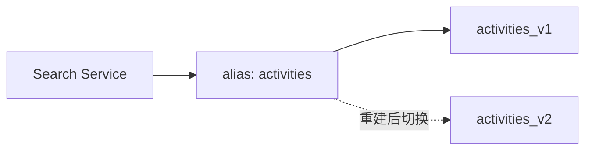
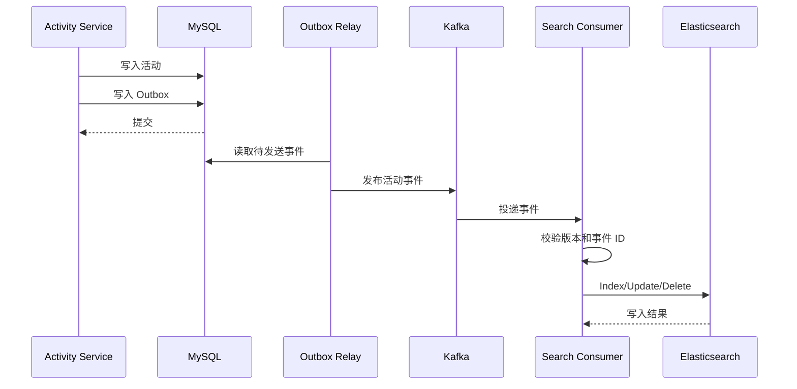
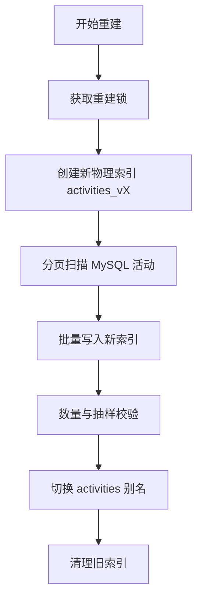

# Elasticsearch 设计

## 1. 文档目的

本文定义 CampusHub Elasticsearch 的使用边界、索引设计、Mapping、查询方式、Kafka 同步链路、全量重建、降级策略和容器配置。

## 2. 定位与边界

Elasticsearch 是活动搜索和聚合读模型：

- MySQL 是唯一事实来源；
- Elasticsearch 不承担事务写入；
- 前端不直接访问 Elasticsearch；
- 搜索请求统一由 Gin 后端处理；
- 一期只建设活动索引。

一期不进入 ES 的数据：

- 用户公开信息；
- 聊天消息；
- 通知；
- 学生认证敏感信息。

## 3. 索引与别名

### 3.1 物理索引

一期物理索引：

```text
activities_v1
```

### 3.2 查询别名

后端查询统一使用别名：

```text
activities
```

别名指向当前可用物理索引。后续 Mapping 变更时可创建 `activities_v2`，完成重建后切换别名。



## 4. 索引 Mapping

### 4.1 字段设计

| 字段 | ES 类型 | 是否可搜索 | 说明 |
|---|---|---|---|
| `id` | keyword | 精确查询 | 活动 UUID，作为文档 ID |
| `title` | text | 全文搜索 | 活动标题 |
| `title_keyword` | keyword | 精确/排序 | 标题聚合 |
| `description` | text | 全文搜索 | 活动简介和详情 |
| `category_id` | keyword | 过滤 | 分类外部标识 |
| `category_name` | keyword | 过滤/聚合 | 分类名称 |
| `tag_ids` | keyword | 过滤 | 标签外部标识列表 |
| `tag_names` | text/keyword | 搜索/聚合 | 标签名称 |
| `organizer_id` | keyword | 过滤 | 组织者 UUID |
| `organizer_name` | text/keyword | 搜索/聚合 | 组织者名称 |
| `organizer_avatar` | keyword/index false | 不搜索 | 组织者头像 |
| `location` | text/keyword | 搜索/聚合 | 地点名称 |
| `address_detail` | text | 搜索 | 详细地址 |
| `geo_point` | geo_point | 地理查询 | 经纬度 |
| `status` | byte/keyword | 过滤 | 活动状态 |
| `register_start_at` | date | 过滤/排序 | 报名开始时间 |
| `register_end_at` | date | 过滤/排序 | 报名结束时间 |
| `activity_start_at` | date | 过滤/排序 | 活动开始时间 |
| `activity_end_at` | date | 过滤/排序 | 活动结束时间 |
| `max_participants` | integer | 过滤 | 最大人数 |
| `approved_participant_count` | integer | 排序/展示 | 已通过报名人数 |
| `pending_participant_count` | integer | 展示 | 待审批人数 |
| `view_count` | long | 排序 | 浏览量 |
| `like_count` | integer | 排序 | 点赞数 |
| `version` | long | 版本控制 | 活动版本 |
| `deleted` | boolean | 过滤 | 是否删除 |
| `created_at` | date | 排序 | 创建时间 |
| `updated_at` | date | 排序/版本 | 更新时间 |

### 4.2 中文分词

Mapping 中的日期字段统一接收和返回 Unix 毫秒时间戳；搜索服务负责将 MySQL `DATETIME(3)` 转换为毫秒值。

自托管 Elasticsearch 可安装 IK Analysis 插件：

- 标题使用 `ik_max_word` 建索引；
- 查询使用 `ik_smart`；
- 标签和分类名称使用 keyword；
- 地点可结合 text 和 keyword。

如果部署环境不能安装 IK 插件，则使用 Elasticsearch 标准分词器，并通过标签、分类和 keyword 字段保证基础筛选能力。

### 4.3 索引设置

建议：

- 开发环境 `number_of_shards=1`；
- 开发环境 `number_of_replicas=0`；
- 生产环境根据数据量设置分片和副本；
- 搜索写入不需要强制实时刷新，可使用默认近实时刷新；
- 对批量重建任务临时调整批量大小和刷新策略。

## 5. 查询接口

后端接口：

```text
GET /api/v1/activities/search
```

查询参数：

| 参数 | 类型 | 说明 |
|---|---|---|
| `keyword` | string | 标题、简介、标签、地点关键词 |
| `category_id` | UUID | 分类过滤 |
| `tag_id` | UUID | 标签过滤 |
| `status` | int | 公开状态：`2` 已发布、`3` 进行中、`4` 已结束 |
| `start_time` | Unix 毫秒 | 活动开始时间下限 |
| `end_time` | Unix 毫秒 | 活动开始时间上限 |
| `location` | string | 地点关键词 |
| `longitude` | double | 地理中心经度，可选 |
| `latitude` | double | 地理中心纬度，可选 |
| `distance` | string | 地理距离，例如 `5km` |
| `sort` | string | `start_time`、`created_at`、`hot` 或 `distance`；距离排序需同时提供坐标 |
| `page` | int | 页码 |
| `page_size` | int | 每页数量 |

## 6. 查询逻辑

### 6.1 关键词搜索

使用 `bool` 查询：

- `must`：对标题、描述、标签名称、地点进行 `multi_match`；
- `filter`：状态、分类、标签、时间范围；
- `should`：提高标题和标签命中权重；
- `highlight`：标题和描述高亮；
- `sort`：按时间、热度或距离排序。

### 6.2 权限过滤

普通搜索只返回：

- 未删除；
- 状态为已发布、进行中或已结束；
- 对游客可见的活动。

草稿、待审核、被拒绝活动不能进入普通搜索结果。

### 6.3 分页

一期可使用 `from + size`，但限制最大页数。数据量增大后使用 `search_after` 做深度分页。

### 6.4 聚合

可支持：

- 分类聚合；
- 标签聚合；
- 地点聚合；
- 时间范围聚合。

聚合结果可短 TTL 缓存。

## 7. 数据同步设计

### 7.1 同步方式

采用：

```text
MySQL 本地事务 → Outbox Events → Kafka → Search Consumer → Elasticsearch
```

业务数据和 Outbox 事件在同一 MySQL 事务提交，避免业务写库成功但事件丢失。

### 7.2 同步事件

| 事件类型 | 触发时机 | ES 操作 |
|---|---|---|
| `activity.created` | 活动创建并提交 | 视状态决定是否索引 |
| `activity.updated` | 活动资料更新 | Update / Index |
| `activity.status_changed` | 活动状态变化 | Update 状态或删除索引 |
| `activity.published` | 审核通过或发布 | Index |
| `activity.cancelled` | 活动取消 | Update 或从公开索引删除 |
| `activity.deleted` | 软删除 | Delete |

### 7.3 消息结构

Kafka 消息建议包含：

- `event_id`；
- `event_type`；
- `aggregate_type=activity`；
- `aggregate_id`；
- `version`；
- `trace_id`；
- `occurred_at`；
- `payload`。

### 7.4 幂等写入

消费者应使用活动 `version` 或 `updated_at` 防止旧事件覆盖新数据。

可选方式：

- 使用 ES `external version`；
- Index 前查询版本；
- 使用局部更新并比较版本；
- 以主键保证同一活动只生成一个文档。

## 7.5 同步流程



## 8. 失败与重试

- Kafka 消费失败时按重试策略重新投递；
- 多次失败进入死信队列；
- 消费者必须记录活动 ID、事件 ID 和失败原因；
- 死信处理完成后可重新触发索引；
- 提供按活动 ID 单条修复能力；
- 提供按时间范围批量补偿能力。

## 9. 全量重建

### 9.1 使用场景

- 首次上线初始化 ES；
- Mapping 不兼容变更；
- 索引数据损坏；
- 搜索逻辑发生重大调整。

### 9.2 重建流程



### 9.3 重建要求

- 重建过程不能影响线上搜索；
- 使用新物理索引，不直接覆盖当前索引；
- 支持断点或按 ID 范围恢复；
- 批量写入控制大小和并发；
- 切换别名前校验文档数量和抽样字段；
- 重建失败时保留旧索引。

**实现（阶段 6）**：使用 `cd backend && make reindex` 执行重建。命令默认创建形如 `${elasticsearch.index_prefix}_v{Unix 时间}`（默认 `activities_v…`）的新物理索引，稳定分页构建后执行 refresh、文档数与前三个确定性样本校验；仅校验成功才原子切换 `activities` alias。切换后再扫描 MySQL 补偿切换窗口内的更新；旧索引不自动删除，方便回滚与人工核验。

## 10. 降级策略

Elasticsearch 不可用时：

1. 搜索接口切换为 MySQL 基础查询；
2. 支持标题 LIKE、分类、状态和时间范围；
3. 暂时关闭复杂聚合、地理查询和深度搜索；
4. 返回响应头或日志标记搜索降级；
5. ES 恢复后通过补偿任务重新同步缺失数据。

**实现（阶段 6）**：`GET /api/v1/activities/search` 优先查询 `activities` alias；ES 请求报错、alias 不存在、索引尚未命中或命中已过期 UUID 时自动回退 MySQL 的标题、地点、分类、标签与时间范围查询，保持统一的分页响应，并返回 `X-Search-Mode: elasticsearch` 或 `mysql-fallback`。MySQL 降级不承诺地理距离过滤或排序。

## 11. Docker 规划

开发环境通过 Docker Compose 启动：

- Elasticsearch 单节点；
- Kibana，可选。

开发环境建议：

- 单节点；
- 关闭或简化安全配置；
- 限制 JVM 内存；
- 配置持久化卷；
- Kibana 依赖 Elasticsearch 健康检查。

生产环境应使用独立集群或托管 Elasticsearch，并配置：

- 副本；
- 快照；
- 访问认证；
- 资源监控；
- 索引生命周期策略。

## 12. 监控指标

需要关注：

- 集群健康状态；
- 节点 CPU、内存、磁盘；
- 查询延迟；
- 写入延迟；
- 索引文档数量；
- 搜索错误率；
- Kafka 搜索消费者延迟；
- 死信队列数量；
- 全量重建进度。

## 13. 设计约束

1. 一期只索引活动数据。
2. 搜索写入不能阻塞用户主流程。
3. 搜索结果允许近实时延迟。
4. 所有索引文档必须可从 MySQL 重建。
5. 查询必须经过后端权限和状态过滤。
6. Mapping 变更必须说明是否需要重建索引。
7. ES 异常时必须有 MySQL 降级查询路径。
