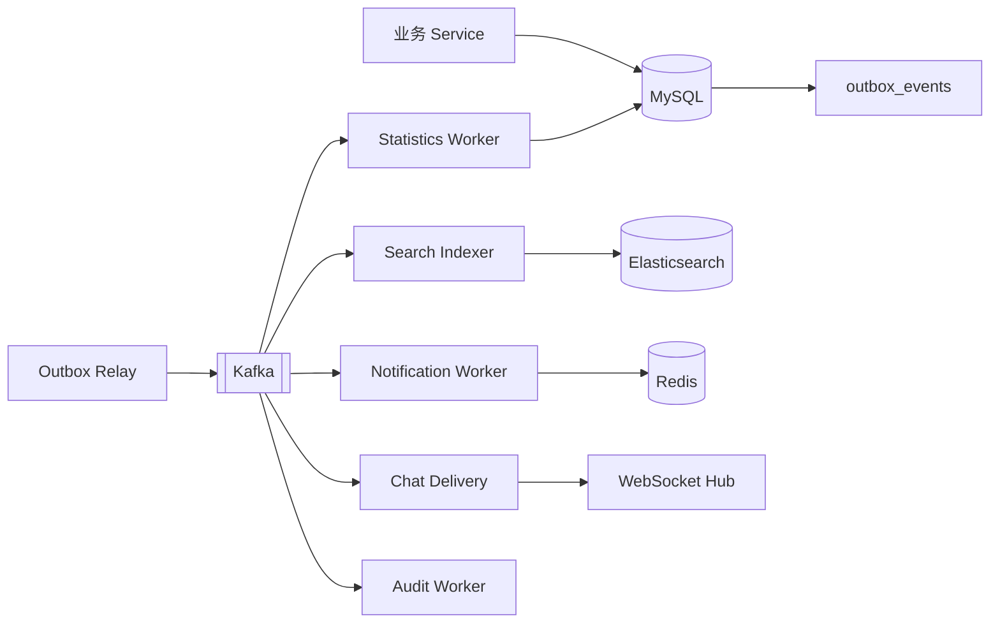

# Kafka 设计

## 1. 文档目的

本文定义 CampusHub 的 Kafka Topic、事件结构、生产与消费模型、消费者组、重试、死信、幂等、顺序性和监控方案。

## 2. 使用目标

Kafka 用于系统解耦和最终一致性，主要承担：

- Elasticsearch 活动索引同步；
- 通知异步投递；
- 聊天消息多实例广播；
- 浏览量和活动统计；
- 审计日志；
- 文件处理；
- Outbox 事件投递。

Kafka 不承担：

- 强一致事务提交；
- 同步返回用户核心操作结果；
- 唯一业务数据存储。

## 3. 总体事件链路



## 4. Topic 规划

### 4.1 Topic 清单

| Topic | Key | 主要事件 | 消费者组 |
|---|---|---|---|
| `campushub.activity.events.v1` | `activity_id` | 活动创建、更新、状态变化、取消、删除 | `campushub.search-indexer`、`campushub.statistics-worker` |
| `campushub.registration.events.v1` | `registration_id` | 报名申请、审批通过、拒绝、超时、取消 | `campushub.notification-worker`、`campushub.chat-membership`、`campushub.realtime-delivery.{instance_id}` |
| `campushub.ticket.events.v1` | `ticket_id` | 票据生成、核销、作废、过期 | `campushub.notification-worker`、`campushub.audit-worker` |
| `campushub.notification.events.v1` | `user_id` | 通知创建、已读、推送 | `campushub.notification-worker` |
| `campushub.verification.events.v1` | `verification_id` | 学生认证提交、确认、取消与审核结果 | `campushub.realtime-delivery.{instance_id}` |
| `campushub.realtime.events.v1` | `user_id` | 已持久化通知的实时投递提示 | `campushub.realtime-delivery.{instance_id}` |
| `campushub.chat.events.v1` | `group_id` | 群消息、成员变化、未读更新 | `campushub.chat-delivery.{instance_id}` |
| `campushub.file.events.v1` | `file_id` | 文件上传完成、审核、清理 | `campushub.file-worker` |
| `campushub.system.audit.v1` | `operator_id` | 登录、权限、管理操作审计 | `campushub.audit-worker` |

### 4.2 Topic 分区建议

开发环境：

- 分区数：1-3；
- 副本因子：1；
- 使用 KRaft 模式。

生产环境：

- 核心 Topic 建议 3 个以上分区；
- 副本因子建议 3；
- 根据吞吐量和消费者数量调整分区；
- 同一业务实体的事件使用相同 Key，保证实体内顺序。

### 4.3 Topic 命名规则

```text
campushub.{domain}.events.v1
```

版本号用于消息结构或语义发生不兼容变化时创建新 Topic。

## 5. 事件信封

推荐统一事件结构：

```json
{
  "event_id": "uuid",
  "event_type": "activity.created",
  "event_version": 1,
  "event_time": 1767232800000,
  "aggregate_type": "activity",
  "aggregate_id": "activity-uuid",
  "trace_id": "trace-id",
  "producer": "campushub-backend",
  "payload": {}
}
```

字段说明：

| 字段 | 说明 |
|---|---|
| `event_id` | 全局唯一事件 ID，用于幂等 |
| `event_type` | 事件类型 |
| `event_version` | 事件结构版本 |
| `event_time` | 事件发生时间 |
| `aggregate_type` | 聚合类型，例如 activity、registration |
| `aggregate_id` | 聚合 ID |
| `trace_id` | 链路追踪 ID |
| `producer` | 生产者名称 |
| `payload` | 事件数据 |

`event_time` 和 `payload` 中的时间字段统一使用 Unix 毫秒时间戳；数据库内部的 `DATETIME(3)` 只在服务端转换，不直接写入事件。

## 6. 事件类型

### 6.1 活动事件

- `activity.created`；
- `activity.updated`；
- `activity.submitted`；
- `activity.approved`；
- `activity.rejected`；
- `activity.cancelled`；
- `activity.deleted`；
- `activity.status_changed`。

### 6.2 报名事件

- `registration.created`；
- `registration.approved`；
- `registration.rejected`；
- `registration.cancelled`；
- `registration.expired`；
- `registration.failed`。

### 6.3 票据事件

- `ticket.created`；
- `ticket.used`；
- `ticket.voided`；
- `ticket.expired`。

### 6.4 聊天与通知事件

- `chat.message_sent`；
- `chat.message_recalled`；
- `chat.member_joined`；
- `chat.member_left`；
- `notification.created`；
- `notification.read`。

通知写入成功时，同一数据库事务还会写入 `realtime.notification_created` outbox 事件；relay 将其投递到 `campushub.realtime.events.v1`。该事件只是 WebSocket 提示，离线补偿仍以通知 HTTP 接口为准。

### 6.5 文件与系统事件

- `file.uploaded`；
- `file.reviewed`；
- `file.cleanup_required`；
- `system.audit_log`。

## 7. 生产模型

### 7.1 Outbox 模式

所有需要可靠投递的业务事件先写入 `outbox_events`。

流程：

1. Service 开启 MySQL 事务；
2. 写入业务数据；
3. 写入 Outbox 事件；
4. 提交事务；
5. Outbox Relay 扫描待发送事件；
6. Relay 发布到 Kafka；
7. 发布成功后标记事件为已发送。

### 7.2 Outbox Relay

Relay 可以：

- 嵌入后端进程；
- 独立为 worker；
- 多实例运行时抢占批次：当前实现用 `SELECT ... FOR UPDATE SKIP LOCKED` 在数据库里抢占不重叠的行，不需要额外的 Redis 锁；
- 按批次拉取事件；
- 支持失败重试和退避。

### 7.3 不采用直接双写

业务代码不应在同一个请求中先写 MySQL 再直接写 Kafka 并以该方式作为唯一保障，因为任一组件失败都可能造成不一致。

> **例外（阶段 5）**：群聊消息不走 outbox。消息本体是 `chat_messages` 的持久化记录，`campushub.chat.events.v1` 只承载实时投递提示（消费者组 `campushub.chat-delivery.{instance_id}`），投递失败不会造成业务数据不一致，成员仍可通过 `GET /api/v1/groups/{id}/messages` 或 `GET /api/v1/messages/offline` 补齐；这样避免把聊天延迟绑在 outbox relay 的扫描周期上。活动、报名、票据、通知等业务事件仍然只走 outbox。

## 8. 消费模型

### 8.1 消费者组

| 消费者组 | 职责 |
|---|---|
| `campushub.search-indexer` | 消费 `campushub.activity.events.v1`，回读 MySQL 后以活动版本写入 Elasticsearch 索引 |
| `campushub.notification-worker` | 发送通知、更新未读计数 |
| `campushub.chat-membership` | 依据报名审批/取消/拒绝/超时事件维护活动群成员关系 |
| `campushub.chat-delivery.{instance_id}` | 将消息投递到 WebSocket；每个实例使用独立消费者组接收全部聊天事件 |
| `campushub.realtime-delivery.{instance_id}` | 将通知、学生认证与报名状态变化投递到 WebSocket；每个实例使用独立消费者组接收全部投递提示和业务状态事件 |
| `campushub.statistics-worker` | 更新浏览量、标签统计和活动统计 |
| `campushub.audit-worker` | 写入审计日志 |
| `campushub.file-worker` | 文件处理和清理 |

### 8.2 消费提交策略

推荐：

- 业务处理成功后再提交 Offset；
- 可使用手动提交；
- 失败时不提交，进入重试；
- 消费者必须保持幂等，因为 At-least-once 可能导致重复投递。

### 8.3 顺序性

- 同一活动 ID 的事件写入同一分区；
- 同一用户 ID 的通知事件写入同一分区；
- 同一群 ID 的聊天事件写入同一分区；
- 消费者通过版本号防止旧事件覆盖新事件。

跨实体事件不保证全局顺序。

## 9. 幂等设计

消费者可根据以下字段实现幂等：

- `event_id`；
- `aggregate_id`；
- 业务唯一键；
- 数据版本号。

常见做法：

| 任务 | 幂等方式 |
|---|---|
| ES 写入 | 使用活动 ID 作为文档 ID，并比较版本 |
| 通知发送 | 通知 UUID 唯一，重复事件不重复入库 |
| 票据核销 | 票据状态和核销唯一索引保证只核销一次 |
| 统计更新 | 事件 ID 去重，或按周期覆盖统计结果 |
| 审计日志 | 事件 ID 唯一索引 |

## 10. 重试与死信

### 10.1 可重试错误

- Elasticsearch 短暂不可用；
- Redis 短暂不可用；
- 网络超时；
- 数据库短暂死锁；
- 下游限流。

### 10.2 不可重试错误

- 消息格式错误；
- 聚合数据不存在且无法补偿；
- 权限数据不合法；
- 版本永久无法解析。

### 10.3 死信 Topic

建议命名：

```text
campushub.{domain}.events.v1.dlq
```

死信消息保留：

- 原始事件；
- 失败原因；
- 失败消费者组；
- 重试次数；
- 首次失败和最后失败时间。

### 10.4 重试策略

可使用：

- 消费者本地有限重试；
- 延迟重试 Topic；
- 死信 Topic；
- 人工修复后重新投递。

重试间隔应指数退避，避免故障期间持续冲击下游。

## 11. 典型场景

### 11.1 搜索索引同步

1. 活动服务写 MySQL 和 Outbox；
2. Relay 发布活动事件；
3. Search Indexer 消费；
4. 根据事件类型 Index、Update 或 Delete；
5. 失败进入重试或 DLQ。

### 11.2 报名与审批通知

1. 报名事务提交；
2. 无需审批时发布报名通过和票据事件；
3. 需要审批时先发布待审批事件，暂不发布票据事件；
4. 组织者审批通过后发布报名通过、票据生成和入群事件；
5. 审批拒绝或超时后发布对应结束事件；
6. Notification Worker 创建通知并通过 WebSocket 推送；
7. 用户离线时保留通知和未读计数。

### 11.3 聊天消息广播

1. 发送方通过 WebSocket 发送消息；
2. 服务端持久化消息；
3. 发布聊天事件；
4. 每个实例的 Chat Delivery 消费者组按群投递到本实例连接；
5. 在线用户收到 `new_message`。

## 12. 监控指标

需要监控：

- Topic 生产和消费速率；
- 消费者组 Lag；
- Broker CPU、内存、磁盘；
- 请求队列大小；
- 生产失败次数；
- 消费错误次数；
- 重试次数；
- DLQ 消息数量；
- 消费耗时；
- 分区负载均衡情况。

## 13. 安全与权限

- Kafka 开发环境可简化认证；
- 生产环境启用认证和 ACL；
- 不同应用使用独立账号；
- Topic 的生产和消费权限最小化；
- 消息中不直接存放密码、完整证件号等敏感数据；
- 学生认证事件只传递必要字段。

## 14. 设计约束

1. 核心业务结果以 MySQL 提交为准，Kafka 只处理异步后续动作。
2. 所有事件必须有唯一事件 ID。
3. 所有消费者必须幂等。
4. 同一聚合实体的事件必须使用稳定分区 Key。
5. 失败事件必须可追踪、可重试、可人工修复。
6. 不混用多个 Kafka 客户端库。
7. Topic、事件类型和消费者组名称必须集中配置。
