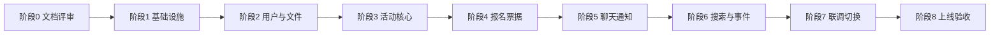

# 重构与迁移计划

## 1. 文档目的

本文定义 CampusHub 从旧 go-zero 后端迁移到 Go + Gin + GORM + MySQL + Redis + Kafka + Elasticsearch 新后端的阶段安排、任务顺序、数据迁移、兼容策略、测试、风险、回滚和验收标准。

## 2. 重构范围

### 2.1 本次包含

- 新后端基础工程；
- 认证与用户资料；
- 分类和标签；
- 活动发布、编辑、列表、详情；
- 活动报名和取消；
- 票据生成、查询和核销；
- 活动群、消息、通知；
- WebSocket；
- Redis 和 Ristretto 缓存；
- Kafka 事件；
- Elasticsearch 活动搜索；
- Docker Compose；
- 历史数据迁移。

### 2.2 本次不包含

- 前端业务重写；
- 支付系统；
- 复杂组织后台；
- 聊天全文搜索；
- 用户和通知的 Elasticsearch 索引；
- 多机房部署。

## 3. 总体阶段

## 4. 阶段计划

### 阶段 0：文档评审

任务：

- 评审系统设计文档；
- 确认接口范围；
- 确认数据库表和索引；
- 确认 Kafka Topic；
- 确认 ES 索引和同步策略；
- 确认部署方式。

产出：

- 已确认的系统设计文档；
- 待确认问题清单；
- 开发排期。

### 阶段 1：基础设施

任务：

- 初始化 Go 工程；
- 接入 Viper；
- 接入 Zap；
- 接入 Gin；
- 接入 GORM；
- 接入 Redis；
- 接入 Kafka；
- 接入 Elasticsearch；
- 配置 Docker Compose；
- 建立健康检查和统一响应。

验收：

- 本地可以启动全部核心依赖；
- 后端可连接 MySQL、Redis、Kafka、ES；
- `/health` 和 `/ready` 正常。

### 阶段 2：用户与文件

任务：

- 注册、登录、退出；
- Token 刷新和撤销；
- 用户资料查询和修改；
- 密码修改和重置；
- 图片上传；
- 文件元数据；
- 兴趣标签维护；
- 学生认证基础数据结构。

验收：

- 前端登录注册流程可用；
- Token 自动刷新可用；
- 图片可上传并返回 URL；
- 用户兴趣可保存。

### 阶段 3：活动核心

任务：

- 分类列表；
- 标签列表；
- 活动创建；
- 活动编辑；
- 活动提交审核；
- 活动取消；
- 活动列表；
- 活动详情；
- 活动状态日志；
- 活动状态定时流转。

验收：

- 前端可发布活动；
- 首页可展示活动；
- 活动详情字段完整；
- 活动状态能按时间自动变化。

### 阶段 4：报名、票据与核销

任务：

- 报名条件校验；
- 名额控制；
- 报名申请记录；
- 报名审批、拒绝和超时；
- 报名取消；
- 审批通过后的票据生成；
- 票据列表和详情；
- 票据核销；
- 核销记录；
- 报名、审批和票据相关通知事件。

验收：

- 用户可提交报名、取消报名；
- 需要审批的活动在通过前不生成票据；
- 审批通过后生成票据并加入活动群；
- 重复核销被阻止；
- 组织者可查看报名、审批和核销记录。

### 阶段 5：聊天、通知与 WebSocket

任务：

- 活动群创建；
- 群成员管理；
- 群历史消息；
- 文字和图片消息；
- 通知创建、已读、全部已读；
- WebSocket 认证；
- 心跳、ACK、断线重连；
- 多实例消息广播；
- 离线消息和未读计数。

验收：

- 无需审批的活动报名成功后可收到活动群；
- 需要审批的活动审批通过后可收到活动群；
- 群成员可实时聊天；
- 通知可实时推送；
- 断线后可通过 HTTP 补齐消息。

### 阶段 6：搜索与事件完善

任务：

- 创建 `activities_v1` 索引；
- 配置活动 Mapping；
- Kafka 同步活动事件；
- 全量重建任务；
- 搜索接口；
- 分类、标签、时间、地点筛选；
- ES 降级 MySQL 查询。

验收：

- 关键词可搜索活动；
- 活动变更后索引最终一致；
- 全量重建和别名切换可执行；
- ES 停止时基础搜索仍可用。

### 阶段 7：联调与前端切换

任务：

- 按前端接口清单逐项联调；
- 必要时提供旧路径兼容映射；
- 修复字段命名和响应差异；
- 完成端到端测试；
- 压测核心接口；
- 前端切换 Base URL。

验收：

- 前端当前功能全部可运行；
- 旧接口兼容层有明确删除时间；
- 核心接口性能满足要求。

### 阶段 8：上线验收

任务：

- 部署生产环境；
- 迁移历史数据；
- 执行数据校验；
- 启动全量索引；
- 灰度切换；
- 观察日志、指标和告警；
- 完成上线记录。

验收：

- 用户可正常登录、发布、报名、核销、聊天；
- 数据无明显丢失；
- 监控和告警有效；
- 回滚方案可用。

## 5. 数据迁移计划

### 5.1 迁移前准备

- 冻结旧库结构变更；
- 备份旧数据库；
- 准备标签合并映射；
- 准备用户、活动、群聊 ID 映射表；
- 清理明显脏数据；
- 确认旧库时间字段口径。

### 5.2 迁移顺序

推荐顺序：

1. 用户基础数据；
2. 角色和信用数据；
3. 分类和标签；
4. 活动数据；
5. 活动标签关系；
6. 报名记录及报名状态日志；
7. 仅针对已通过报名生成票据和核销记录；
8. 活动群和已通过报名的群成员；
9. 消息和通知；
10. Outbox 初始化和 ES 全量索引。

### 5.3 时间字段转换

旧库中 Unix 时间戳需要转换为 MySQL `DATETIME(3)`，并在 API、WebSocket 和 Kafka 输出时统一为 Unix 毫秒时间戳。转换时必须确认：

- 秒级还是毫秒级；
- 时区；
- 零值含义；
- 是否存在未来或异常时间。

迁移脚本必须显式区分秒级和毫秒级来源，统一转换为毫秒后再写入新库；接口层禁止把数据库时间字符串直接透传给客户端。

### 5.4 标签合并

旧 `interest_tags` 和 `tag_cache` 合并时：

- 按名称标准化；
- 去除空格和大小写差异；
- 建立旧 ID 到新 ID 的映射；
- 更新用户兴趣和活动标签关系；
- 重新计算标签使用次数。

### 5.5 报名、票据和群成员转换

- 旧系统中无需审批且报名成功的记录转换为 `approved`；
- 旧系统中已取消、失败记录转换为对应终态，不生成票据和群成员关系；
- 新系统需要审批的活动，未完成审批的记录转换为 `pending`；
- 票据只与 `approved` 报名关联；
- 活动群成员只包含组织者和 `approved` 报名用户；
- 为每条状态转换补写报名状态日志和必要的群事件。

### 5.6 迁移校验

校验内容：

- 用户、活动、报名、票据、群、消息总数；
- 活动与分类、组织者关联；
- 报名与票据一一对应，且只有 approved 报名存在票据；
- 已核销票据必须存在核销记录；
- 活动群成员与 approved 报名记录一致；
- 抽样核对页面展示数据；
- ES 文档数量与可索引活动数量一致。

## 6. API 兼容策略

迁移期可支持旧路径：

- 旧路由只做适配；
- 兼容层调用新 Service；
- 不复制旧业务逻辑；
- 记录旧接口调用量；
- 前端切换完成后删除兼容路由。

优先兼容前端正在使用的路径，不兼容已确认废弃的管理接口。

## 7. 测试策略

### 7.1 单元测试

覆盖：

- 状态流转；
- 报名条件；
- 票据状态；
- 密码和 Token；
- 缓存 Key；
- 事件结构。

### 7.2 集成测试

覆盖：

- MySQL 事务；
- Redis 锁；
- Kafka 生产消费；
- ES 写入和查询；
- 文件上传；
- WebSocket 认证和消息。

### 7.3 契约测试

以前端接口清单为基线，逐个校验：

- 路径；
- Method；
- 请求字段；
- 响应字段；
- 错误码；
- 鉴权行为。

### 7.4 端到端测试

核心流程：

1. 用户注册登录；
2. 组织者发布活动；
3. 用户报名；
4. 获取票据；
5. 加入活动群；
6. 发送消息；
7. 组织者核销；
8. 活动结束并归档。

### 7.5 性能测试

重点关注：

- 首页活动列表；
- 活动搜索；
- 报名并发；
- 票据核销；
- WebSocket 消息广播；
- Kafka 消费吞吐；
- ES 全量重建。

## 8. 风险与应对

| 风险 | 影响 | 应对 |
|---|---|---|
| 前端接口遗漏 | 页面不可用 | 以接口清单逐项联调，兼容旧路由 |
| 标签合并错误 | 兴趣和活动标签错乱 | 建立映射表，迁移后抽样校验 |
| 报名并发超卖 | 活动名额异常 | 数据库事务、行锁或唯一约束 |
| Kafka 消费重复 | 重复通知或统计 | 事件 ID 幂等和业务唯一键 |
| ES 同步延迟 | 新活动搜不到 | 明确近实时预期，提供补偿任务 |
| WebSocket 多实例丢消息 | 用户收不到消息 | Kafka 广播、消息落库、离线补偿 |
| 历史数据脏数据 | 迁移失败 | 迁移前清洗，失败数据进入修复清单 |
| 生产密钥泄露 | 安全风险 | 环境变量注入，日志脱敏 |
| 切换后故障 | 业务中断 | 灰度发布、保留旧后端和回滚方案 |

## 9. 回滚策略

上线切换前：

- 保留旧后端部署；
- 保留旧数据库只读或可写能力；
- 前端可切回旧 Base URL；
- 新库写入和旧库写入不要在无校验情况下长期并行；
- 明确回滚负责人和操作步骤。

回滚后：

- 收集故障原因；
- 导出新系统日志和指标；
- 修复后重新演练迁移；
- 未完成校验前不再次切换。

## 10. 验收标准

### 10.1 功能验收

- 注册、登录、退出正常；
- 用户资料和兴趣可维护；
- 活动可发布、编辑、取消；
- 活动列表和详情正常；
- 活动可报名、取消；
- 票据可查询、核销；
- 活动群和消息正常；
- 通知可推送、已读；
- 活动搜索和筛选正常。

### 10.2 数据验收

- 核心表总数校验通过；
- 关键关联完整性通过；
- 标签和分类映射正确；
- 票据核销状态正确；
- ES 文档数量和抽样结果正确；
- 未读计数与数据库记录一致。

### 10.3 非功能验收

- 健康检查正确；
- 日志包含 Trace ID；
- 核心指标可采集；
- 关键接口延迟满足目标；
- 限流和权限校验生效；
- 服务可优雅重启；
- Docker Compose 可重复启动。

## 11. Definition of Done

一个功能只有满足以下条件才算完成：

1. 对应接口已按 API 文档实现；
2. 数据写入和状态流转经过测试；
3. 关键路径有日志和必要指标；
4. 权限校验完成；
5. 前端页面可完成对应操作；
6. 异常路径有明确错误响应；
7. 数据可迁移、可补偿；
8. 相关文档已同步更新。
